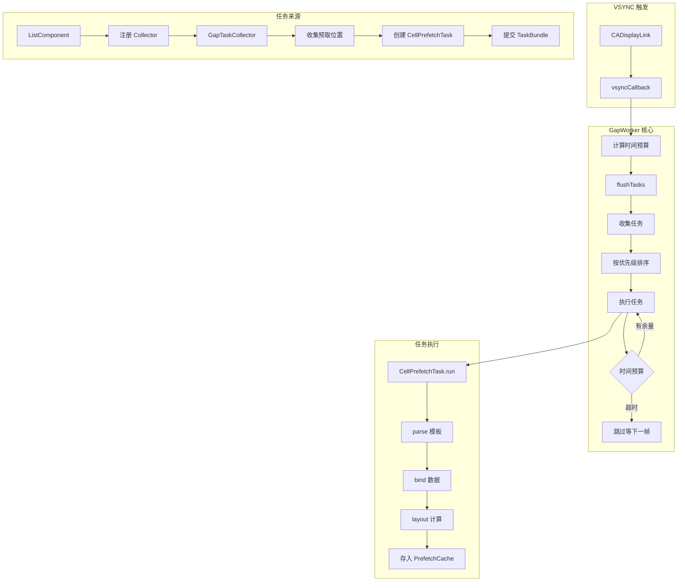
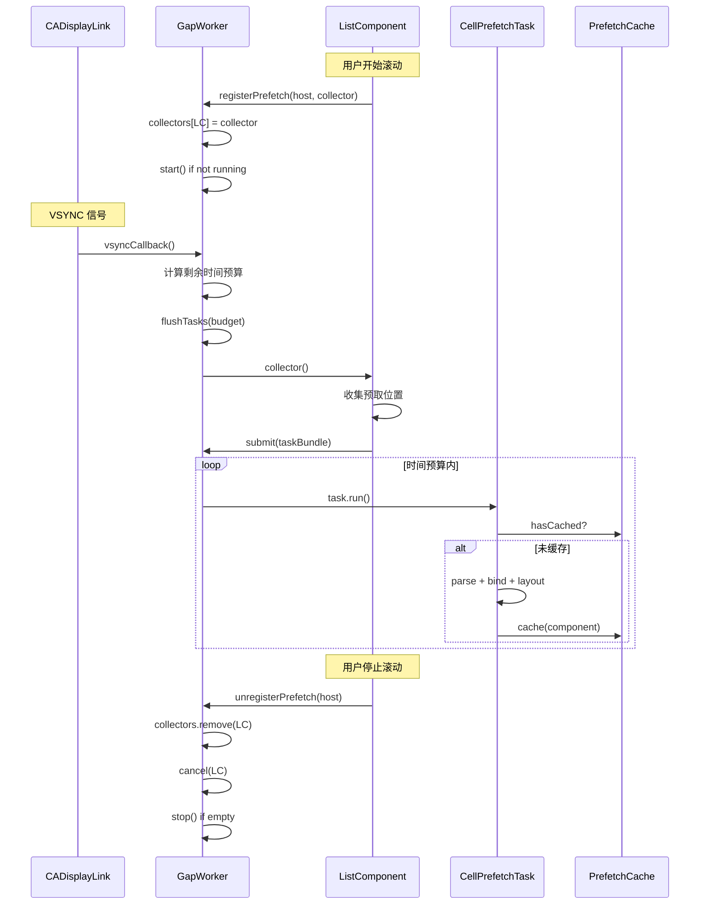

# TemplateX 系列（六）：GapWorker 帧空闲调度 - 让列表滚动丝滑如飞

> 本文是 TemplateX 系列的第六篇，深入解析 GapWorker 机制 —— 一个借鉴 Lynx 的帧空闲任务调度系统，通过利用渲染间隙预取 Cell，实现流畅的列表滚动体验。

## 效果预览

先看一个快速滚动的场景：

```
无 GapWorker：
┌─────────────────────────────────────────────┐
│ 滚动 → Cell 进入屏幕 → 同步渲染 → 掉帧卡顿  │
│                                             │
│ 用户感知：滚动不流畅，有明显顿挫感           │
└─────────────────────────────────────────────┘

有 GapWorker：
┌─────────────────────────────────────────────┐
│ 滚动 → Cell 进入屏幕 → 已预渲染 → 直接显示   │
│                                             │
│ 用户感知：60fps 丝滑滚动                     │
└─────────────────────────────────────────────┘
```

**Question**: 如何在不影响主线程渲染的前提下，提前渲染即将出现的 Cell？

---

## 1. 核心思想：利用"帧间空闲时间"

### 1.1 传统渲染的问题

传统列表渲染采用"按需创建"策略：

```
VSYNC_N                               VSYNC_N+1
   │                                      │
   ▼                                      ▼
   ├──────────── 16.67ms ─────────────────┤
   │                                      │
   │  ┌────────────────────────────────┐  │
   │  │ Cell 进入屏幕                   │  │
   │  │    ↓                           │  │
   │  │ 同步执行：                      │  │
   │  │   parse: 2ms                   │  │
   │  │   bind:  1ms                   │  │
   │  │   layout: 2ms                  │  │
   │  │   createView: 3ms              │  │
   │  │   ─────────────                │  │
   │  │   总计: 8ms                    │  │
   │  │                                │  │
   │  │ 主线程渲染: 8ms                 │  │
   │  │   ─────────────                │  │
   │  │   总计: 16ms → 掉帧！          │  │
   │  └────────────────────────────────┘  │
```

当 Cell 创建耗时 + 主线程渲染耗时 > 16.67ms 时，就会掉帧。

### 1.2 GapWorker 的解决方案

GapWorker 利用每帧渲染完成后的**空闲时间**，提前渲染即将出现的 Cell：

```
┌────────────────────────────────────────────────────────┐
│  一帧 16.67ms（60fps）的时间分配                        │
├────────────────────────────────────────────────────────┤
│                                                         │
│  ├─── 主线程渲染（约 8ms）───┼─── 空闲时间（约 8ms）───┤ │
│                               │                         │
│       处理当前帧               │    GapWorker 在这里     │
│       - 布局                  │    预渲染下一屏 Cell     │
│       - 绘制                  │                         │
│       - 动画                  │                         │
│                                                         │
└────────────────────────────────────────────────────────┘
```

**核心公式**：

```swift
时间预算 = 1秒 / 刷新率 / 2
// 60fps:  16.67ms / 2 = 8.33ms
// 120fps:  8.33ms / 2 = 4.17ms
```

---

## 2. 架构设计

### 2.1 整体架构



### 2.2 与 Lynx 的对应关系

| Lynx 组件 | TemplateX 组件 | 源码位置 |
|-----------|---------------|---------|
| `GapWorker` | `TemplateXGapWorker` | `gap_worker.h` |
| `GapTask` | `GapTask` 协议 | `gap_task.h` |
| `GapTaskBundle` | `GapTaskBundle` | `gap_task.h:56` |
| `ListPrefetchTask` | `CellPrefetchTask` | `base_list_view.h:354` |
| `LayoutPrefetchRegistry` | `PrefetchRegistry` | `base_list_view.h:44` |
| `GetAverageBindTime()` | `PerformanceMonitor` | `list_adapter.cc:109` |

---

## 3. 核心组件实现

### 3.1 TemplateXGapWorker - 核心调度器

`TemplateXGapWorker` 是整个系统的核心，负责：
- 管理任务收集器（collectors）
- 管理任务队列（taskMap）
- 在 VSYNC 回调中执行任务

```swift
// GapWorker/TemplateXGapWorker.swift

final class TemplateXGapWorker {
    
    static let shared = TemplateXGapWorker()
    
    // MARK: - 时间预算
    
    /// 每帧时间预算（纳秒）
    /// 公式：1,000,000,000 / refreshRate / 2
    private(set) var maxEstimateDuration: Int64 = 8_333_333  // 60fps 默认值
    
    /// 当前屏幕刷新率
    private(set) var refreshRate: Int = 60
    
    // MARK: - 任务管理
    
    /// 任务收集器 [host ObjectIdentifier -> collector]
    private var collectors: [ObjectIdentifier: GapTaskCollector] = [:]
    
    /// 任务队列 [host ObjectIdentifier -> taskBundle]
    private var taskMap: [ObjectIdentifier: GapTaskBundle] = [:]
    
    /// 上一帧的任务列表（已排序，扁平化）
    private var lastTaskList: [GapTask] = []
    
    /// 数据是否变化（需要重新排序）
    private var dataChanged: Bool = false
    
    // MARK: - CADisplayLink
    
    private var displayLink: CADisplayLink?
    private(set) var isRunning: Bool = false
}
```

**Step 1: 检测屏幕刷新率**

```swift
private func detectRefreshRate() {
    // iOS 10.3+ 可以获取屏幕最大刷新率（支持 ProMotion）
    if #available(iOS 10.3, *) {
        let maxFrameRate = UIScreen.main.maximumFramesPerSecond
        refreshRate = maxFrameRate  // 60 或 120
    }
    
    // 计算时间预算：1秒(纳秒) / 刷新率 / 2
    maxEstimateDuration = 1_000_000_000 / Int64(refreshRate) / 2
}
```

| 刷新率 | 每帧时间 | 闲时预算 |
|--------|---------|---------|
| 60fps | 16.67ms | **8.33ms** |
| 120fps (ProMotion) | 8.33ms | **4.17ms** |

**Question**: 为什么除以 2？

因为我们需要保守估计 —— 前半帧给主线程渲染（布局、绘制、动画），后半帧给 GapWorker 做预取。这样即使预取任务超时，也不会影响下一帧的渲染。

**Step 2: VSYNC 回调**

```swift
@objc private func vsyncCallback(_ displayLink: CADisplayLink) {
    // 计算本帧剩余时间
    let now = CACurrentMediaTime()
    let targetTime = displayLink.targetTimestamp  // 下一帧的目标时间（系统提供）
    let remainingTime = targetTime - now
    
    // 取剩余时间的一半作为闲时预算（转换为纳秒）
    let endTimeNanos = Int64(remainingTime * 1_000_000_000 / 2)
    
    // 如果剩余时间太少（小于 1ms），跳过本帧
    guard endTimeNanos > 1_000_000 else { return }
    
    flushTasks(timeBudgetNanos: endTimeNanos)
}
```

**关键点：`targetTimestamp` 是系统提供的确定值**

屏幕刷新是固定频率的，系统提前知道下一帧什么时候到来：

```
VSYNC_N (timestamp)              VSYNC_N+1 (targetTimestamp)
    │                                  │
    ▼                                  ▼
    ├──────────── 16.67ms ─────────────┤
    │                                  │
    │  ┌──────────┐  ┌───────────────┐ │
    │  │ 主线程    │  │ DisplayLink  │ │
    │  │ 渲染工作  │  │ 回调触发      │ │
    │  │          │  │   ↓          │ │
    │  │          │  │  now         │ │
    │  └──────────┘  └───────────────┘ │
    │                  │               │
    │                  │<── 剩余时间 ──>│
    │                  │               │
    │             remainingTime        │
    │          = targetTimestamp - now │
```

**Step 3: 执行任务**

```swift
func flushTasks(timeBudgetNanos: Int64) {
    // 1. 收集任务（调用所有注册的 collector）
    collectTasksIfNeeded()
    
    // 2. 如果没有任务，直接返回
    guard !taskMap.isEmpty else { return }
    
    // 3. 如果数据变化，重新排序
    if dataChanged {
        rebuildTaskList()  // 扁平化 + 按优先级排序
        dataChanged = false
    }
    
    // 4. 执行任务
    var remainingBudget = timeBudgetNanos
    
    for task in lastTaskList {
        let estimatedTime = task.estimateDuration
        
        // 时间不够且不强制执行 → 跳过
        if remainingBudget < estimatedTime && !task.enableForceRun {
            continue
        }
        
        // 执行任务
        let taskStart = CACurrentMediaTime()
        task.run()
        let taskDuration = Int64((CACurrentMediaTime() - taskStart) * 1_000_000_000)
        
        remainingBudget -= taskDuration
        
        // 预算用完，停止执行
        if remainingBudget <= 0 { break }
    }
}
```

### 3.2 GapTask 协议与 TaskBundle

```swift
// GapWorker/GapTask.swift

/// 闲时任务协议
protocol GapTask: AnyObject {
    /// 任务 ID（通常是 Cell position）
    var taskId: Int { get }
    
    /// 估算执行耗时（纳秒）
    var estimateDuration: Int64 { get }
    
    /// 优先级（距离视口越近，值越小，优先级越高）
    var priority: Int { get }
    
    /// 是否强制执行（即使时间预算不足）
    var enableForceRun: Bool { get }
    
    /// 执行任务
    func run()
}
```

**GapTaskBundle** 管理一组相关的任务：

```swift
final class GapTaskBundle {
    
    private(set) var tasks: [GapTask] = []
    private(set) var priority: Int = Int.max  // 最小优先级
    weak var host: AnyObject?
    
    /// 添加任务
    func addTask(_ task: GapTask) {
        tasks.append(task)
        // 更新最小优先级
        if task.priority < priority {
            priority = task.priority
        }
    }
    
    /// 按优先级排序（距离越小越优先）
    func sort() {
        tasks.sort { $0.priority < $1.priority }
    }
}
```

### 3.3 PrefetchRegistry - 预取位置收集器

根据滚动方向，收集即将进入屏幕的 Cell 位置：

```swift
// GapWorker/PrefetchRegistry.swift

/// 预加载项信息
struct PrefetchItemInfo {
    let position: Int      // Cell 位置
    let distance: CGFloat  // 距离视口的距离
}

/// 预加载位置收集器
final class PrefetchRegistry {
    
    private(set) var prefetchItemInfos: [Int: PrefetchItemInfo] = [:]
    
    /// 添加预加载位置
    func addPosition(_ position: Int, distance: CGFloat) {
        // 如果已存在，取距离更小的
        if let existing = prefetchItemInfos[position] {
            if distance < existing.distance {
                prefetchItemInfos[position] = PrefetchItemInfo(position: position, distance: distance)
            }
        } else {
            prefetchItemInfos[position] = PrefetchItemInfo(position: position, distance: distance)
        }
    }
    
    /// 获取排序后的预加载位置（按距离排序）
    func getSortedPositions() -> [PrefetchItemInfo] {
        return prefetchItemInfos.values.sorted { $0.distance < $1.distance }
    }
}
```

**LinearLayoutPrefetchHelper** 根据滚动方向计算预取位置：

```swift
struct LinearLayoutPrefetchHelper {
    
    var prefetchBufferCount: Int = 3  // 提前预取几个 Cell
    
    func collectPrefetchPositions(
        into registry: PrefetchRegistry,
        visibleRange: Range<Int>,
        totalCount: Int,
        scrollDirection: CGFloat,
        averageItemSize: CGFloat
    ) {
        registry.clearPrefetchPositions()
        
        if scrollDirection > 0 {
            // 向下/向右滚动 → 预取后面的 Cell
            let startPosition = visibleRange.upperBound
            let endPosition = min(startPosition + prefetchBufferCount, totalCount)
            
            for position in startPosition..<endPosition {
                let distance = CGFloat(position - visibleRange.upperBound + 1) * averageItemSize
                registry.addPosition(position, distance: distance)
            }
        } else if scrollDirection < 0 {
            // 向上/向左滚动 → 预取前面的 Cell
            let startPosition = max(visibleRange.lowerBound - prefetchBufferCount, 0)
            let endPosition = visibleRange.lowerBound
            
            for position in startPosition..<endPosition {
                let distance = CGFloat(visibleRange.lowerBound - position) * averageItemSize
                registry.addPosition(position, distance: distance)
            }
        }
    }
}
```

```
滚动方向示意：

scrollDirection > 0（向下滚动）：
┌─────────────────────┐
│     可见区域         │
│  [Cell 3] [Cell 4]  │
│  [Cell 5] [Cell 6]  │
└─────────────────────┘
         ↓ 预取方向
    [Cell 7] [Cell 8] [Cell 9]  ← 待预取

scrollDirection < 0（向上滚动）：
    [Cell 0] [Cell 1] [Cell 2]  ← 待预取
         ↑ 预取方向
┌─────────────────────┐
│     可见区域         │
│  [Cell 3] [Cell 4]  │
│  [Cell 5] [Cell 6]  │
└─────────────────────┘
```

### 3.4 CellPrefetchTask - Cell 预渲染任务

```swift
// GapWorker/CellPrefetchTask.swift

final class CellPrefetchTask: GapTask {
    
    let taskId: Int              // Cell position
    let estimateDuration: Int64  // 估算耗时
    let priority: Int            // 优先级（距离）
    let enableForceRun: Bool     // 是否强制执行
    
    let templateId: String
    let templateJson: [String: Any]
    let cellData: [String: Any]
    let containerSize: CGSize
    
    private weak var hostView: AnyObject?
    
    func run() {
        // 1. 检查宿主是否还存在
        guard hostView != nil else { return }
        
        // 2. 检查是否已缓存
        let cacheKey = PrefetchCache.cacheKey(templateId: templateId, position: taskId)
        if PrefetchCache.shared.hasCached(cacheKey: cacheKey) {
            return  // 已缓存，跳过
        }
        
        // 3. Parse 模板
        guard let component = TemplateParser.shared.parse(json: templateJson) else {
            return
        }
        
        // 4. Bind 数据
        DataBindingManager.shared.bind(data: cellData, to: component)
        
        // 5. Layout 计算
        _ = YogaLayoutEngine.shared.calculateLayout(
            for: component,
            containerSize: containerSize
        )
        
        // 6. 标记 prefetch 并缓存
        if let baseComponent = component as? BaseComponent {
            baseComponent.componentFlags.insert(.prefetch)
        }
        
        let item = PrefetchedItem(
            component: component,
            position: taskId,
            templateId: templateId
        )
        PrefetchCache.shared.cache(item, forKey: cacheKey)
        
        // 7. 更新平均绑定时间（用于下次估算）
        PerformanceMonitor.shared.updateAverageBindTime(
            templateId: templateId,
            newValue: taskDurationNanos
        )
    }
}
```

### 3.5 PrefetchCache - 预取缓存

```swift
final class PrefetchCache {
    
    static let shared = PrefetchCache()
    
    /// 每种模板的最大缓存数量
    var maxLimitPerTemplate: Int = 30
    
    private var cache: [String: PrefetchedItem] = [:]
    private var templateKeys: [String: [String]] = [:]  // LRU 淘汰
    
    static func cacheKey(templateId: String, position: Int) -> String {
        return "\(templateId)_\(position)"
    }
    
    func cache(_ item: PrefetchedItem, forKey key: String) {
        let templateId = item.templateId
        
        // LRU 淘汰
        var keys = templateKeys[templateId] ?? []
        if keys.count >= maxLimitPerTemplate {
            if let oldestKey = keys.first {
                cache.removeValue(forKey: oldestKey)
                keys.removeFirst()
            }
        }
        
        cache[key] = item
        keys.append(key)
        templateKeys[templateId] = keys
    }
    
    func get(cacheKey: String) -> PrefetchedItem? {
        return cache.removeValue(forKey: cacheKey)  // 取出后移除
    }
}
```

---

## 4. 平均绑定时间计算

### 4.1 加权平均算法

单次任务耗时波动较大，使用**加权平均**来估算未来任务的耗时：

```swift
// 公式：新平均值 = 旧平均值 × 75% + 本次耗时 × 25%

func updateAverageBindTime(templateId: String, newValue: Int64) {
    let oldAverage = averageBindTimes[templateId] ?? newValue
    // 加权平均：旧值占 3/4，新值占 1/4
    averageBindTimes[templateId] = (oldAverage * 3 / 4) + (newValue / 4)
}
```

**计算示例**：

| 执行次数 | 本次耗时 | 平均值计算 | 新平均值 |
|---------|---------|-----------|---------|
| 1 | 4ms | 首次直接用 | **4ms** |
| 2 | 6ms | 4×0.75 + 6×0.25 | **4.5ms** |
| 3 | 3ms | 4.5×0.75 + 3×0.25 | **4.125ms** |
| 4 | 5ms | 4.125×0.75 + 5×0.25 | **4.34ms** |

**优点**：
- 平滑波动，避免单次异常值影响估算
- 新值权重 25%，逐渐适应变化
- 旧值权重 75%，保持稳定性

### 4.2 为什么用墙钟时间

在任务前后打点测量的是**墙钟时间（Wall Clock Time）**，而不是 CPU 时间。

**Question**: 如果测量期间有其他任务在执行，测量结果会偏大吗？

是的，但这不是问题：

1. **GapWorker 在主线程执行，且时机特殊**：在 VSYNC 回调的后半段，主线程渲染已完成，干扰较少
2. **加权平均会平滑异常值**：偶尔一次被干扰导致偏大，只占 25% 权重
3. **预算本身就是保守的**：只用帧时间的一半，即使估算偏大也不影响主线程渲染

---

## 5. CADisplayLink 工作机制

### 5.1 RunLoop 触发时机

CADisplayLink 是加在 **RunLoop** 上的，它的回调会在 **RunLoop 处理 Timer 阶段** 被调用：

```
┌─────────────────────────────────────────────────────────┐
│                     RunLoop 一次循环                     │
├─────────────────────────────────────────────────────────┤
│                                                          │
│  1. 处理 Source0（触摸事件、手势）                        │
│                    ↓                                     │
│  2. 处理 Source1（系统端口事件）                          │
│                    ↓                                     │
│  3. 处理 Timer（CADisplayLink 在这里触发）  ← 回调触发    │
│                    ↓                                     │
│  4. 处理 Observer                                        │
│                    ↓                                     │
│  5. 处理 GCD main queue                                  │
│                    ↓                                     │
│  6. 如果没事干 → 休眠                                    │
│                                                          │
└─────────────────────────────────────────────────────────┘
```

**当 `vsyncCallback` 被调用时，说明 RunLoop 已处理完高优先级任务**：

| 优先级 | 任务类型 |
|--------|---------|
| 高 | 触摸事件、手势 |
| 中 | UI 布局、绘制 |
| 低 | Timer（包括 CADisplayLink） |

### 5.2 主线程阻塞时的行为

如果主线程被阻塞，CADisplayLink 回调会被**延迟或跳过**：

```
正常情况：
VSYNC_1     VSYNC_2     VSYNC_3
   │           │           │
   ▼           ▼           ▼
   回调1       回调2       回调3    ← 每帧都触发


主线程阻塞：
VSYNC_1     VSYNC_2     VSYNC_3     VSYNC_4
   │           │           │           │
   ▼           │           │           ▼
   回调1       ✗           ✗          回调2   ← 中间的被跳过
         └─── 主线程阻塞 50ms ───┘
```

**关键点：CADisplayLink 不会排队，错过的帧直接丢弃**

这避免了回调堆积导致雪崩：

```
❌ 错误设计（假设会排队）：
阻塞 100ms → 恢复后连续触发 6 次回调 → 主线程又被阻塞

✅ 正确设计（实际行为）：
阻塞 100ms → 恢复后只触发最新的回调 → 主线程继续正常工作
```

### 5.3 回调延后的处理

回调可能被延后，这正是 GapWorker 每帧**实时计算剩余时间**的原因：

```swift
let remainingTime = targetTimestamp - now

// remainingTime < 0 意味着已经掉帧了
// remainingTime < 1ms 意味着没有足够时间
if remainingTime < 0.001 { 
    return  // 跳过，等下一帧
}
```

**GapWorker 不假设"有多少时间可用"，而是每帧实时计算剩余时间**：
- 剩余时间多 → 多执行几个任务
- 剩余时间少 → 少执行或跳过
- 已经超时 → 直接跳过

---

## 6. 完整时序图



---

## 7. 使用示例

### 7.1 在 ListComponent 中集成

```swift
class ListPreloadManager: GapTaskProvider {
    
    private let prefetchRegistry = PrefetchRegistry()
    private let prefetchHelper = LinearLayoutPrefetchHelper()
    private let taskBundle: GapTaskBundle
    
    var templateId: String = ""
    var templateJson: [String: Any] = [:]
    var dataSource: [[String: Any]] = []
    var cellSize: CGSize = .zero
    
    init(host: AnyObject) {
        taskBundle = GapTaskBundle(host: host)
    }
    
    /// 注册到 GapWorker
    func register() {
        TemplateXGapWorker.shared.registerPrefetch(host: self) { [weak self] in
            self?.collectTasks()
        }
    }
    
    /// 取消注册
    func unregister() {
        TemplateXGapWorker.shared.unregisterPrefetch(host: self)
    }
    
    /// 收集预取任务
    private func collectTasks() {
        taskBundle.clear()
        
        // 1. 根据滚动方向收集预取位置
        prefetchHelper.collectPrefetchPositions(
            into: prefetchRegistry,
            visibleRange: currentVisibleRange,
            totalCount: dataSource.count,
            scrollDirection: lastScrollVelocity,
            averageItemSize: estimatedItemHeight
        )
        
        // 2. 创建预取任务
        for info in prefetchRegistry.getSortedPositions() {
            let task = CellPrefetchTask(
                position: info.position,
                templateId: templateId,
                templateJson: templateJson,
                cellData: dataSource[info.position],
                containerSize: cellSize,
                estimateDuration: getAverageBindTime(),
                priority: Int(info.distance),
                hostView: self
            )
            taskBundle.addTask(task)
        }
        
        // 3. 提交到 GapWorker
        TemplateXGapWorker.shared.submit(taskBundle: taskBundle, host: self)
    }
}
```

### 7.2 在 cellForItemAt 中使用预取的组件

```swift
func collectionView(_ collectionView: UICollectionView, 
                    cellForItemAt indexPath: IndexPath) -> UICollectionViewCell {
    let cell = collectionView.dequeueReusableCell(...)
    
    // 尝试获取预取的组件
    let cacheKey = PrefetchCache.cacheKey(templateId: templateId, position: indexPath.item)
    
    if let prefetchedItem = PrefetchCache.shared.get(cacheKey: cacheKey) {
        // 命中预取缓存！直接使用预渲染的组件
        let component = prefetchedItem.component
        
        // 只需要创建视图（parse + bind + layout 已完成）
        let view = RenderEngine.shared.createView(from: component)
        cell.contentView.addSubview(view)
        
        return cell
    }
    
    // 未命中，降级到同步渲染
    let view = RenderEngine.shared.render(
        json: templateJson,
        data: dataSource[indexPath.item],
        containerSize: cellSize
    )
    cell.contentView.addSubview(view)
    
    return cell
}
```

---

## 8. 性能收益

### 8.1 理论分析

| 场景 | 无 GapWorker | 有 GapWorker |
|------|-------------|--------------|
| 快速滚动 | 掉帧（Cell 同步创建） | 流畅（Cell 已预取） |
| 首次显示 | 冷启动延迟 | 预热 + 预取 |
| 内存占用 | 按需创建 | 预取缓存（可配置上限） |

### 8.2 执行示例

假设 60fps，每帧预算 8ms：

```
第 1 帧：
├── 剩余预算: 8ms
├── 任务队列: [Cell6(预估3ms), Cell7(预估3ms), Cell8(预估3ms)]
│
├── Cell6: 预估3ms < 8ms → 执行 → 实际耗时2.5ms → 剩余5.5ms
├── Cell7: 预估3ms < 5.5ms → 执行 → 实际耗时3ms → 剩余2.5ms
├── Cell8: 预估3ms > 2.5ms → 跳过（等下一帧）
│
└── 本帧完成: Cell6, Cell7

第 2 帧：
├── 剩余预算: 8ms
├── 任务队列: [Cell8(预估2.8ms), Cell9(预估2.8ms), Cell10(预估2.8ms)]
│                    ↑ 平均耗时已更新
│
├── Cell8: 执行 → 剩余5.2ms
├── Cell9: 执行 → 剩余2.4ms
├── Cell10: 跳过
│
└── 本帧完成: Cell8, Cell9
```

---

## 9. Tips

### 9.1 关键配置

| 配置项 | 默认值 | 说明 |
|--------|-------|------|
| 刷新率 | 60/120fps | 自动检测 ProMotion |
| 时间预算 | 8ms/4ms | 每帧可用时间 |
| 缓存上限 | 30 | 每种模板的最大缓存数 |
| 预加载缓冲 | 3 | 预加载的 Cell 数量 |

### 9.2 注册/取消注册时机

| 滚动状态 | 操作 |
|---------|------|
| 开始拖拽 | `registerPrefetch()` |
| Fling 开始 | 保持注册 |
| 停止滚动 | `unregisterPrefetch()` |

### 9.3 与 Lynx 的实现差异

| 机制 | Lynx | TemplateX (iOS) |
|------|------|-----------------|
| VSYNC 信号来源 | 引擎内部 Compositor | CADisplayLink |
| 任务调度 | TaskRunner | RunLoop |
| 闲时检测 | 渲染流水线完成后 | RunLoop Timer 阶段 |
| 跨平台 | Android/iOS 统一 | iOS only |

---

## 10. 总结

GapWorker 的核心价值：

1. **时间切片**：利用帧间空闲时间，不阻塞主线程
2. **优先级调度**：距离越近的 Cell 优先预取
3. **自适应预算**：根据屏幕刷新率动态调整
4. **加权平均估时**：平滑波动，准确预测任务耗时

通过这套机制，列表滚动可以保持 60fps/120fps 的流畅体验，即使 Cell 内容复杂也不会掉帧。

---

## 下一篇预告

下一篇文章将聚焦 **性能优化实战**，汇总 TemplateX 各模块的优化技巧：

- 引擎预热（warmUp）
- Yoga 剪枝（增量布局）
- 样式解析优化（StyleParser）
- 组件/视图复用策略
- 性能监控与调优

敬请期待！
