# TemplateX：从零构建 iOS DSL 动态渲染引擎（完整指南）

> 基于 Yoga + ANTLR4 的高性能动态化框架，支持 Flexbox 布局、表达式绑定、增量更新和 GapWorker 列表优化

## 目录

1. [概述与架构设计](#1-概述与架构设计)
2. [模板解析与组件系统](#2-模板解析与组件系统)
3. [Flexbox 布局引擎](#3-flexbox-布局引擎)
4. [表达式引擎与数据绑定](#4-表达式引擎与数据绑定)
5. [Diff + Patch 增量更新](#5-diff--patch-增量更新)
6. [GapWorker 列表优化](#6-gapworker-列表优化)
7. [性能优化实战](#7-性能优化实战)

---

## 1. 概述与架构设计

### 1.1 设计背景

在 iOS 开发中，动态化能力已成为现代应用的标配需求。传统方案各有局限：

| 方案 | 优点 | 缺点 |
|------|------|------|
| **纯原生开发** | 性能最佳、开发效率高 | 无法热更新，发版周期长 |
| **H5 / Web** | 跨平台、热更新 | 渲染性能差、交互体验不佳 |
| **React Native** | 热更新、开发体验好 | 包体积大、桥接开销 |
| **Flutter** | 高性能、热更新 | 引擎体积大（~10MB） |
| **小程序方案** | 热更新、生态完善 | 性能瓶颈、内存占用高 |
| **Lynx** | 高性能、Yoga 布局 | 依赖 C++ 基础设施 |

### Question

> 能否用纯 Swift 构建一个轻量级的动态化框架，兼顾性能与开发效率？

**TemplateX** 是基于这个问题的探索：借鉴 Lynx 架构，用 Swift 实现的高性能 DSL 动态渲染框架。

### 1.2 整体架构

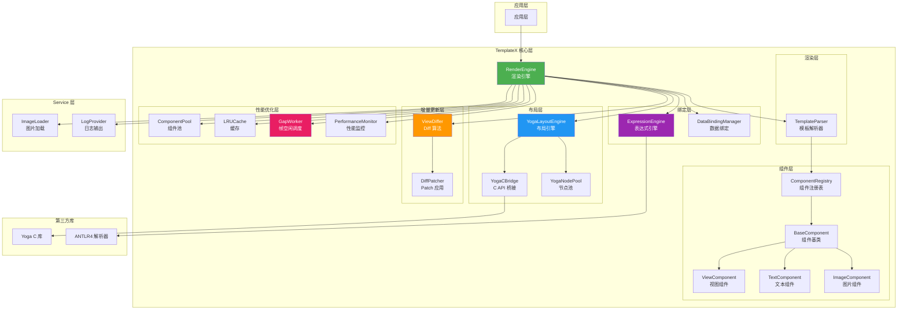

### 1.3 核心特性

- ✅ **JSON → UIView 渲染**：声明式 UI，模板驱动
- ✅ **Flexbox 布局**：基于 Yoga C API，支持子线程布局计算
- ✅ **数据绑定**：`${expression}` 表达式求值
- ✅ **增量更新**：Diff + Patch 算法，最小化视图操作
- ✅ **组件化**：可扩展的组件注册机制
- ✅ **高性能**：组件树复用、布局缓存、异步渲染
- ✅ **列表优化**：GapWorker 帧空闲调度，对标 Lynx

### 1.4 Quick Start

#### 安装

```ruby
# Podfile
pod 'TemplateX', '~> 1.0'
pod 'TemplateXService', '~> 1.0'
```

#### 基础使用

```swift
import TemplateX

// 1. 定义模板
let template: [String: Any] = [
    "type": "flex",
    "props": ["direction": "column"],
    "style": [
        "padding": 16,
        "backgroundColor": "#F5F5F5"
    ],
    "children": [
        [
            "type": "text",
            "props": ["text": "Hello TemplateX!"],
            "style": [
                "fontSize": 24,
                "color": "#333333"
            ]
        ],
        [
            "type": "image",
            "props": ["src": "https://example.com/image.png"],
            "style": [
                "width": 200,
                "height": 200
            ]
        ]
    ]
]

// 2. 渲染视图
let containerView = UIView(frame: CGRect(x: 0, y: 0, width: 375, height: 667))
let renderedView = RenderEngine.shared.render(
    json: template,
    containerSize: containerView.bounds.size
)

containerView.addSubview(renderedView)
```

### 1.5 性能数据

| 场景 | 耗时 | 说明 |
|------|------|------|
| 单模板解析（首次） | ~6.6ms | 冷启动，含缓存初始化 |
| 单模板解析（缓存） | ~0.1ms | 模板原型缓存命中 |
| 数据绑定 | ~0.01ms | 表达式求值 |
| 布局计算（单树） | ~0.1ms | Yoga 引擎 |
| 视图创建（10节点） | ~0.3ms | UIView 创建 |
| **总渲染（预热后）** | **~10ms** | 6 个 Flexbox Demo |

### 1.6 渲染流程

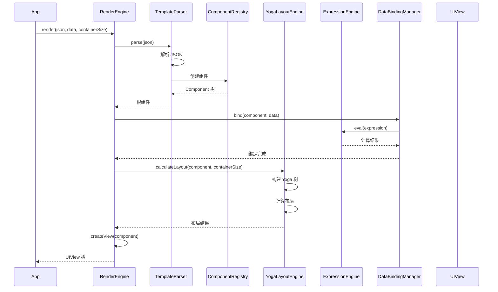

---

## 2. 模板解析与组件系统

### 2.1 JSONWrapper

在开始解析模板之前，我们需要一个 JSON 访问的工具类。`JSONWrapper` 封装了字典和数组的访问操作，提供类型安全的方法。

```swift
/// JSON 封装工具，提供类型安全的访问方法
final class JSONWrapper {
    private let value: Any
    
    init(_ value: Any) {
        self.value = value
    }
    
    var dictionary: [String: Any]? {
        value as? [String: Any]
    }
    
    var array: [Any]? {
        value as? [Any]
    }
    
    func string(_ key: String) -> String? {
        dictionary?[key] as? String
    }
    
    func int(_ key: String) -> Int? {
        dictionary?[key] as? Int
    }
    
    func bool(_ key: String) -> Bool? {
        dictionary?[key] as? Bool
    }
    
    func child(_ key: String) -> JSONWrapper? {
        guard let child = dictionary?[key] else { return nil }
        return JSONWrapper(child)
    }
}
```

### 2.2 TemplateParser

`TemplateParser` 负责将 JSON 模板解析为组件树。它使用递归下降的方式遍历 JSON 结构，通过 `ComponentRegistry` 创建对应的组件实例。

#### 解析流程

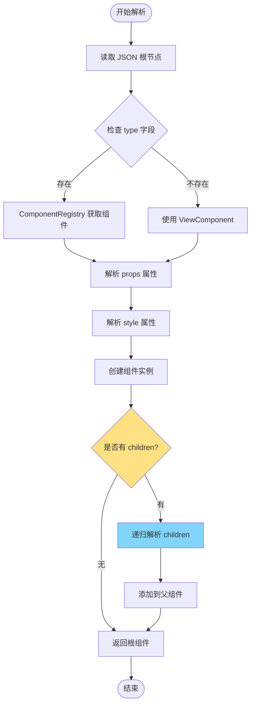

#### 核心代码

```swift
/// 模板解析器
final class TemplateParser {
    static let shared = TemplateParser()
    
    private init() {}
    
    private var templateCache: [String: Component] = [:]
    
    /// 解析 JSON 模板为组件树
    func parse(_ json: [String: Any]) -> Component {
        let wrapper = JSONWrapper(json)
        return parseNode(wrapper)
    }
    
    private func parseNode(_ wrapper: JSONWrapper) -> Component {
        let type = wrapper.string("type") ?? "view"
        
        // 从注册表获取组件工厂
        let component: Component
        if let factory = ComponentRegistry.shared.factory(for: type) {
            component = factory.create(from: wrapper)
        } else {
            // 降级到基础视图组件
            component = ViewComponent(id: wrapper.string("id") ?? UUID().uuidString, type: type)
        }
        
        // 递归解析 children
        if let childrenArray = wrapper.child("children")?.array {
            for child in childrenArray {
                if let childDict = child as? [String: Any] {
                    let childComponent = parseNode(JSONWrapper(childDict))
                    component.children.append(childComponent)
                }
            }
        }
        
        return component
    }
}
```

### 2.3 组件系统

#### Component 协议

```swift
/// 组件协议
public protocol Component: AnyObject {
    var id: String { get }
    var type: String { get }
    var style: ComponentStyle { get set }
    var children: [Component] { get set }
    var view: UIView? { get set }
    
    func createView() -> UIView
    func updateView()
    func clone() -> Component
}

/// 组件工厂协议
public protocol ComponentFactory: AnyObject {
    static var typeIdentifier: String { get }
    static func create(from json: JSONWrapper) -> Component
}
```

#### BaseComponent

```swift
/// 组件基类
open class BaseComponent: Component {
    public let id: String
    public let type: String
    public var style: ComponentStyle = ComponentStyle()
    public var children: [Component] = []
    public weak var view: UIView?
    
    public init(id: String, type: String) {
        self.id = id
        self.type = type
    }
    
    open func createView() -> UIView {
        let v = UIView()
        v.tag = id.hashValue
        return v
    }
    
    open func updateView() {
        guard let v = view else { return }
        applyStyle(to: v)
    }
    
    open func clone() -> Component {
        let cloned = BaseComponent(id: id, type: type)
        cloned.style = style
        cloned.children = children.map { $0.clone() }
        return cloned
    }
    
    func applyStyle(to view: UIView) {
        if let bgColor = style.backgroundColor {
            view.backgroundColor = bgColor
        }
        if let radius = style.cornerRadius {
            view.layer.cornerRadius = radius
        }
        // ... 更多样式属性
    }
}
```

### 2.4 ComponentRegistry

组件注册表负责管理所有可用的组件类型。

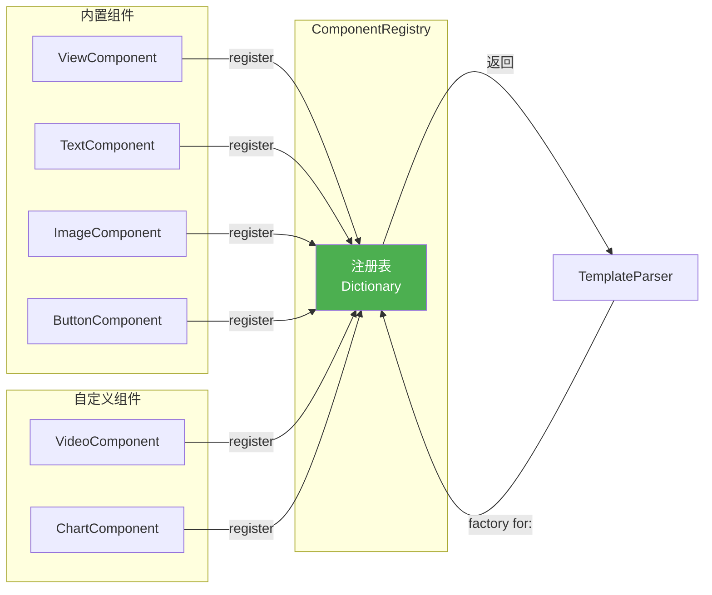

#### 核心代码

```swift
/// 组件注册表
final class ComponentRegistry {
    static let shared = ComponentRegistry()
    
    private var factories: [String: ComponentFactory.Type] = [:]
    
    private init() {
        registerBuiltInComponents()
    }
    
    /// 注册组件工厂
    func register(_ factory: ComponentFactory.Type) {
        factories[factory.typeIdentifier] = factory
    }
    
    /// 获取组件工厂
    func factory(for type: String) -> ComponentFactory.Type? {
        factories[type]
    }
    
    /// 注册内置组件
    private func registerBuiltInComponents() {
        register(ViewComponent.self)
        register(TextComponent.self)
        register(ImageComponent.self)
        register(ButtonComponent.self)
        register(FlexLayoutComponent.self)
        register(ScrollComponent.self)
        register(ListComponent.self)
    }
}
```

### 2.5 Props 解析

组件的 `props` 属性用于配置组件行为。不同的组件有不同的 props。

#### Props 解析流程

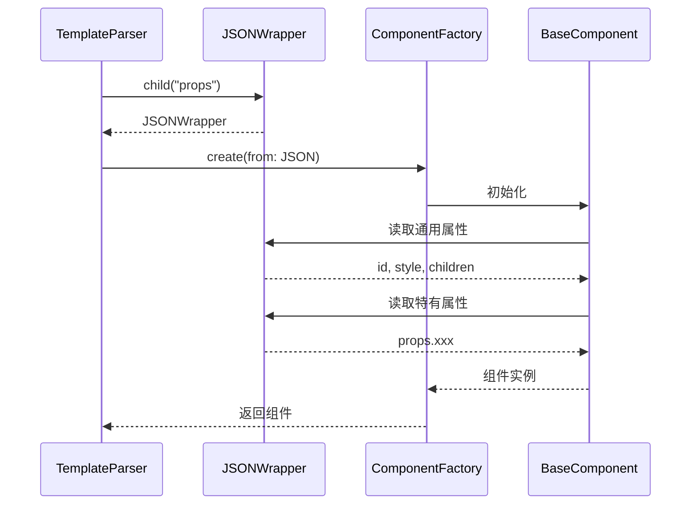

#### 示例：ImageComponent

```swift
public class ImageComponent: BaseComponent, ComponentFactory {
    public static var typeIdentifier: String { "image" }
    
    var imageUrl: String?
    var contentMode: UIView.ContentMode = .scaleAspectFit
    
    public static func create(from json: JSONWrapper) -> Component {
        let component = ImageComponent(
            id: json.string("id") ?? UUID().uuidString,
            type: typeIdentifier
        )
        
        // 解析通用属性
        component.parseBaseParams(from: json)
        
        // 解析 image 特有属性
        if let props = json.child("props") {
            component.imageUrl = props.string("src")
            if let modeStr = props.string("contentMode") {
                component.contentMode = ContentMode(rawValue: modeStr) ?? .scaleAspectFit
            }
        }
        
        return component
    }
    
    public override func createView() -> UIView {
        let imageView = UIImageView()
        view = imageView
        updateView()
        return imageView
    }
    
    public override func updateView() {
        guard let imageView = view as? UIImageView else { return }
        
        if let url = imageUrl {
            imageView.sd_setImage(with: URL(string: url))
        }
        imageView.contentMode = contentMode
        applyStyle(to: imageView)
    }
}
```

### 2.6 模板缓存

为了避免重复解析相同的模板，`TemplateParser` 实现了模板原型缓存。

```swift
/// 使用模板缓存渲染
public func renderWithCache(
    json: [String: Any],
    templateId: String,
    data: [String: Any]? = nil,
    containerSize: CGSize
) -> UIView? {
    // 1. 检查缓存
    if let prototype = templateCache[templateId] {
        // 2. 克隆原型
        let component = prototype.clone()
        
        // 3. 数据绑定
        if let data = data {
            DataBindingManager.shared.bind(component, data: data)
        }
        
        // 4. 计算布局
        YogaLayoutEngine.shared.calculateLayout(for: component, containerSize: containerSize)
        
        // 5. 创建视图
        return createViewTree(from: component)
    }
    
    // 6. 解析并缓存
    let component = parse(json)
    templateCache[templateId] = component
    
    // 继续渲染流程
    return renderWithCache(json: json, templateId: templateId, data: data, containerSize: containerSize)
}
```

### 2.7 自定义组件示例

```swift
/// 视频组件
public class VideoComponent: BaseComponent, ComponentFactory {
    public static var typeIdentifier: String { "video" }
    
    var videoUrl: String?
    var autoplay: Bool = false
    
    public static func create(from json: JSONWrapper) -> Component {
        let component = VideoComponent(
            id: json.string("id") ?? UUID().uuidString,
            type: typeIdentifier
        )
        
        component.parseBaseParams(from: json)
        
        if let props = json.child("props") {
            component.videoUrl = props.string("src")
            component.autoplay = props.bool("autoplay") ?? false
        }
        
        return component
    }
    
    public override func createView() -> UIView {
        let playerView = AVPlayerView()
        view = playerView
        
        if let url = videoUrl {
            let player = AVPlayer(url: URL(string: url)!)
            playerView.player = player
            if autoplay {
                player.play()
            }
        }
        
        applyStyle(to: playerView)
        return playerView
    }
    
    public override func clone() -> Component {
        let cloned = VideoComponent(id: id, type: type)
        cloned.style = style
        cloned.videoUrl = videoUrl
        cloned.autoplay = autoplay
        cloned.children = children.map { $0.clone() }
        return cloned
    }
}
```

### 2.8 组件注册

```swift
// AppDelegate.swift
func application(_ application: UIApplication, didFinishLaunchingWithOptions ...) {
    // 注册自定义组件
    TemplateX.register(VideoComponent.self)
    TemplateX.register(ChartComponent.self)
    TemplateX.register(LottieComponent.self)
}
```

---

## 3. Flexbox 布局引擎

### 3.1 Yoga 简介

Yoga 是 Facebook 开源的跨平台布局引擎，实现了 CSS Flexbox 规范。TemplateX 集成了 Yoga C API，提供了高性能的布局计算能力。

### 3.2 整体架构

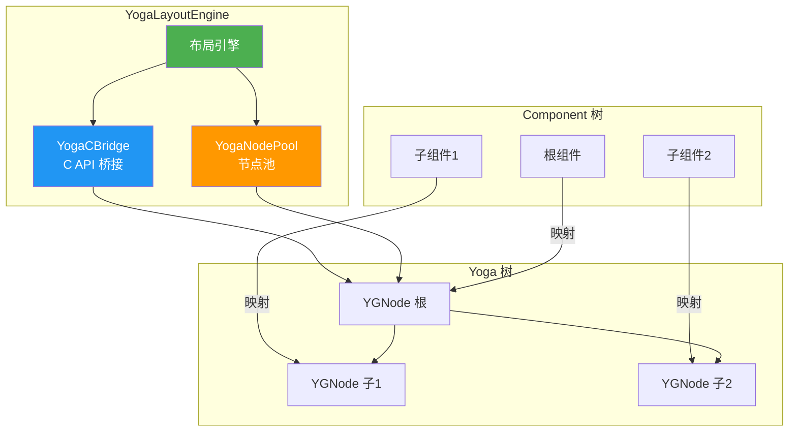

### 3.3 YogaCBridge

`YogaCBridge` 封装了 Yoga C API，提供 Swift 友好的接口。

```swift
/// Yoga C API 桥接
enum YogaCBridge {
    
    // ===== 节点创建/销毁 =====
    
    static func newNode() -> YGNodeRef {
        return YGNodeNew()
    }
    
    static func freeNode(_ node: YGNodeRef) {
        YGNodeFree(node)
    }
    
    // ===== 布局属性设置 =====
    
    static func setDirection(_ node: YGNodeRef, direction: YGDirection) {
        YGNodeStyleSetDirection(node, direction)
    }
    
    static func setFlexDirection(_ node: YGNodeRef, direction: YGFlexDirection) {
        YGNodeStyleSetFlexDirection(node, direction)
    }
    
    static func setJustifyContent(_ node: YGNodeRef, justifyContent: YGJustify) {
        YGNodeStyleSetJustifyContent(node, justifyContent)
    }
    
    static func setAlignItems(_ node: YGNodeRef, alignItems: YGAlign) {
        YGNodeStyleSetAlignItems(node, alignItems)
    }
    
    static func setAlignContent(_ node: YGNodeRef, alignContent: YGAlign) {
        YGNodeStyleSetAlignContent(node, alignContent)
    }
    
    static func setPosition(_ node: YGNodeRef, type: YGPositionType) {
        YGNodeStyleSetPositionType(node, type)
    }
    
    static func setPosition(_ node: YGNodeRef, edge: YGEdge, value: CGFloat) {
        YGNodeStyleSetPosition(node, edge, value)
    }
    
    static func setMargin(_ node: YGNodeRef, edge: YGEdge, value: CGFloat) {
        YGNodeStyleSetMargin(node, edge, value)
    }
    
    static func setPadding(_ node: YGNodeRef, edge: YGEdge, value: CGFloat) {
        YGNodeStyleSetPadding(node, edge, value)
    }
    
    static func setBorder(_ node: YGNodeRef, edge: YGEdge, value: CGFloat) {
        YGNodeStyleSetBorder(node, edge, value)
    }
    
    static func setWidth(_ node: YGNodeRef, value: CGFloat) {
        YGNodeStyleSetWidth(node, value)
    }
    
    static func setHeight(_ node: YGNodeRef, value: CGFloat) {
        YGNodeStyleSetHeight(node, value)
    }
    
    static func setFlex(_ node: YGNodeRef, value: CGFloat) {
        YGNodeStyleSetFlex(node, value)
    }
    
    static func setFlexGrow(_ node: YGNodeRef, value: CGFloat) {
        YGNodeStyleSetFlexGrow(node, value)
    }
    
    static func setFlexShrink(_ node: YGNodeRef, value: CGFloat) {
        YGNodeStyleSetFlexShrink(node, value)
    }
    
    static func setFlexBasis(_ node: YGNodeRef, value: CGFloat) {
        YGNodeStyleSetFlexBasis(node, value)
    }
    
    static func setAspectRatio(_ node: YGNodeRef, value: CGFloat) {
        YGNodeStyleSetAspectRatio(node, value)
    }
    
    // ===== 文本测量 =====
    
    static func setMeasureFunc(_ node: YGNodeRef, context: UnsafeRawPointer) {
        YGNodeSetMeasureFunc(node, { node, width, widthMode, height, heightMode in
            let ctx = UnsafeMutableRawPointer(mutating: YGNodeGetContext(node))
            let measurer = Unmanaged<TextMeasurer>.fromOpaque(ctx).takeUnretainedValue()
            return measurer.measure(width: width, widthMode: widthMode, height: height, heightMode: heightMode)
        })
        YGNodeSetContext(node, context)
    }
    
    // ===== 布局计算 =====
    
    static func calculateLayout(_ node: YGNodeRef, width: CGFloat, height: CGFloat) {
        YGNodeCalculateLayout(node, width, height, YGDirectionLTR)
    }
    
    // ===== 布局结果获取 =====
    
    static func getLayoutLeft(_ node: YGNodeRef) -> CGFloat {
        return CGFloat(YGNodeLayoutGetLeft(node))
    }
    
    static func getLayoutTop(_ node: YGNodeRef) -> CGFloat {
        return CGFloat(YGNodeLayoutGetTop(node))
    }
    
    static func getLayoutWidth(_ node: YGNodeRef) -> CGFloat {
        return CGFloat(YGNodeLayoutGetWidth(node))
    }
    
    static func getLayoutHeight(_ node: YGNodeRef) -> CGFloat {
        return CGFloat(YGNodeLayoutGetHeight(node))
    }
    
    // ===== 增量布局 =====
    
    static func markDirty(_ node: YGNodeRef) {
        YGNodeMarkDirty(node)
    }
}
```

### 3.4 YogaNodePool

`YogaNodePool` 实现了 YGNode 的对象池，减少内存分配开销。

```swift
/// Yoga 节点池
final class YogaNodePool {
    static let shared = YogaNodePool()
    
    private var pool: [YGNodeRef] = []
    private let maxPoolSize = 100
    private var lock = os_unfair_lock()
    
    private init() {}
    
    /// 获取节点
    func acquire() -> YGNodeRef {
        os_unfair_lock_lock(&lock)
        defer { os_unfair_lock_unlock(&lock) }
        
        if pool.isEmpty {
            return YogaCBridge.newNode()
        }
        return pool.removeLast()
    }
    
    /// 批量获取节点
    func acquireBatch(_ count: Int) -> [YGNodeRef] {
        os_unfair_lock_lock(&lock)
        defer { os_unfair_lock_unlock(&lock) }
        
        var nodes: [YGNodeRef] = []
        for _ in 0..<count {
            if pool.isEmpty {
                nodes.append(YogaCBridge.newNode())
            } else {
                nodes.append(pool.removeLast())
            }
        }
        return nodes
    }
    
    /// 归还节点
    func release(_ node: YGNodeRef) {
        os_unfair_lock_lock(&lock)
        defer { os_unfair_lock_unlock(&lock) }
        
        if pool.count < maxPoolSize {
            pool.append(node)
        } else {
            YogaCBridge.freeNode(node)
        }
    }
    
    /// 批量归还节点
    func releaseBatch(_ nodes: [YGNodeRef]) {
        os_unfair_lock_lock(&lock)
        defer { os_unfair_lock_unlock(&lock) }
        
        let availableSlots = maxPoolSize - pool.count
        let toKeep = min(availableSlots, nodes.count)
        
        for i in 0..<toKeep {
            pool.append(nodes[i])
        }
        
        for i in toKeep..<nodes.count {
            YogaCBridge.freeNode(nodes[i])
        }
    }
}
```

### 3.5 YogaLayoutEngine

`YogaLayoutEngine` 是布局引擎的核心，负责将 Component 树转换为 Yoga 树，计算布局，并将结果应用到组件上。

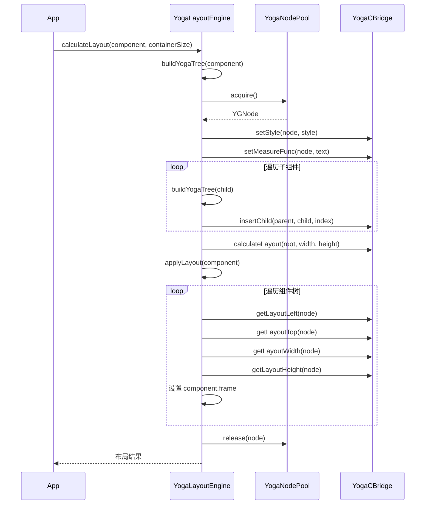

#### 核心代码

```swift
/// Yoga 布局引擎
final class YogaLayoutEngine {
    static let shared = YogaLayoutEngine()
    
    private init() {}
    
    private var textMeasureContextCache: NSMapTable<NSString, TextMeasurer> = NSMapTable.strongToWeakObjects()
    
    /// 计算组件布局
    func calculateLayout(for component: Component, containerSize: CGSize) -> [String: CGRect] {
        // 1. 构建 Yoga 树
        let rootNode = buildYogaTree(from: component)
        
        // 2. 计算布局
        YogaCBridge.calculateLayout(rootNode, containerSize.width, containerSize.height)
        
        // 3. 应用布局结果
        let layoutResults = applyLayout(to: component, node: rootNode)
        
        // 4. 释放 Yoga 树
        releaseYogaTree(rootNode)
        
        return layoutResults
    }
    
    /// 构建 Yoga 树
    private func buildYogaTree(from component: Component) -> YGNodeRef {
        let node = YogaNodePool.shared.acquire()
        applyStyle(to: node, style: component.style)
        
        // 处理文本测量
        if let textComp = component as? TextComponent {
            setupTextMeasure(for: textComp, on: node)
        }
        
        // 递归构建子树
        for (index, child) in component.children.enumerated() {
            let childNode = buildYogaTree(from: child)
            YogaCBridge.insertChild(node, child: childNode, index: UInt32(index))
        }
        
        return node
    }
    
    /// 应用样式到 Yoga 节点
    private func applyStyle(to node: YGNodeRef, style: ComponentStyle) {
        // Flex 方向
        if let flexDirection = style.flexDirection {
            YogaCBridge.setFlexDirection(node, direction: flexDirection.yogaValue)
        }
        
        // 对齐
        if let justifyContent = style.justifyContent {
            YogaCBridge.setJustifyContent(node, justifyContent: justifyContent.yogaValue)
        }
        if let alignItems = style.alignItems {
            YogaCBridge.setAlignItems(node, alignItems: alignItems.yogaValue)
        }
        
        // 尺寸
        if let width = style.width {
            YogaCBridge.setWidth(node, width: width)
        }
        if let height = style.height {
            YogaCBridge.setHeight(node, height: height)
        }
        
        // Flex 属性
        if let flex = style.flex {
            YogaCBridge.setFlex(node, value: flex)
        }
        if let flexGrow = style.flexGrow {
            YogaCBridge.setFlexGrow(node, value: flexGrow)
        }
        if let flexShrink = style.flexShrink {
            YogaCBridge.setFlexShrink(node, value: flexShrink)
        }
        if let flexBasis = style.flexBasis {
            YogaCBridge.setFlexBasis(node, value: flexBasis)
        }
        
        // Margin
        if let margin = style.margin {
            YogaCBridge.setMargin(node, edge: .left, value: margin.left)
            YogaCBridge.setMargin(node, edge: .top, value: margin.top)
            YogaCBridge.setMargin(node, edge: .right, value: margin.right)
            YogaCBridge.setMargin(node, edge: .bottom, value: margin.bottom)
        }
        
        // Padding
        if let padding = style.padding {
            YogaCBridge.setPadding(node, edge: .left, value: padding.left)
            YogaCBridge.setPadding(node, edge: .top, value: padding.top)
            YogaCBridge.setPadding(node, edge: .right, value: padding.right)
            YogaCBridge.setPadding(node, edge: .bottom, value: padding.bottom)
        }
        
        // Position
        if let position = style.position {
            YogaCBridge.setPosition(node, type: .absolute)
            if position.left != nil {
                YogaCBridge.setPosition(node, edge: .left, value: position.left!)
            }
            if position.top != nil {
                YogaCBridge.setPosition(node, edge: .top, value: position.top!)
            }
            if position.right != nil {
                YogaCBridge.setPosition(node, edge: .right, value: position.right!)
            }
            if position.bottom != nil {
                YogaCBridge.setPosition(node, edge: .bottom, value: position.bottom!)
            }
        }
        
        // 宽高比
        if let aspectRatio = style.aspectRatio {
            YogaCBridge.setAspectRatio(node, value: aspectRatio)
        }
    }
    
    /// 设置文本测量
    private func setupTextMeasure(for component: TextComponent, on node: YGNodeRef) {
        let text = component.text ?? ""
        let font = UIFont.systemFont(ofSize: component.style.fontSize ?? 14)
        
        let measurer = TextMeasurer(text: text, font: font)
        textMeasureContextCache.setObject(measurer, forKey: text as NSString)
        
        let context = Unmanaged.passUnretained(measurer).toOpaque()
        YogaCBridge.setMeasureFunc(node, context: context)
    }
    
    /// 应用布局结果到组件
    private func applyLayout(to component: Component, node: YGNodeRef) -> [String: CGRect] {
        var results: [String: CGRect] = [:]
        
        // 应用当前组件布局
        let frame = CGRect(
            x: YogaCBridge.getLayoutLeft(node),
            y: YogaCBridge.getLayoutTop(node),
            width: YogaCBridge.getLayoutWidth(node),
            height: YogaCBridge.getLayoutHeight(node)
        )
        component.calculatedFrame = frame
        results[component.id] = frame
        
        // 递归应用子组件布局
        let childCount = Int(YGNodeGetChildCount(node))
        for i in 0..<childCount {
            let childNode = YGNodeGetChild(node, UInt32(i))
            let childResults = applyLayout(to: component.children[i], node: childNode)
            results.merge(childResults) { _, new in new }
        }
        
        return results
    }
    
    /// 释放 Yoga 树
    private func releaseYogaTree(_ node: YGNodeRef) {
        let childCount = Int(YGNodeGetChildCount(node))
        
        // 先释放子节点
        for i in 0..<childCount {
            let childNode = YGNodeGetChild(node, UInt32(i))
            releaseYogaTree(childNode)
        }
        
        // 再释放自身
        YogaNodePool.shared.release(node)
    }
}
```

### 3.6 增量布局（Yoga 剪枝）

为了优化二次布局性能，TemplateX 实现了增量布局机制：复用组件上的 YGNode，只在样式变化时标记 dirty。

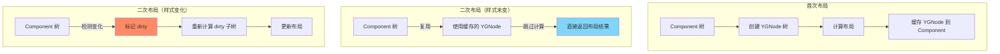

#### 实现方式

```swift
// Component 协议扩展
extension Component {
    private static var yogaNodeKey: UInt8 = 0
    private static var lastLayoutStyleKey: UInt8 = 0
    
    var yogaNode: YGNodeRef? {
        get {
            objc_getAssociatedObject(self, &Self.yogaNodeKey) as? YGNodeRef
        }
        set {
            objc_setAssociatedObject(self, &Self.yogaNodeKey, newValue, .OBJC_ASSOCIATION_RETAIN)
        }
    }
    
    var lastLayoutStyle: ComponentStyle? {
        get {
            objc_getAssociatedObject(self, &Self.lastLayoutStyleKey) as? ComponentStyle
        }
        set {
            objc_setAssociatedObject(self, &Self.lastLayoutStyleKey, newValue, .OBJC_ASSOCIATION_RETAIN)
        }
    }
    
    /// 释放 Yoga 节点
    func releaseYogaNode() {
        if let node = yogaNode {
            YogaNodePool.shared.release(node)
            yogaNode = nil
        }
        lastLayoutStyle = nil
    }
}

// YogaLayoutEngine 增量布局
extension YogaLayoutEngine {
    
    /// 增量布局（默认开启）
    var enableIncrementalLayout: Bool {
        get { _enableIncrementalLayout }
        set { _enableIncrementalLayout = newValue }
    }
    
    private var _enableIncrementalLayout: Bool = true
    
    /// 增量布局计算
    func calculateLayoutIncremental(for component: Component, containerSize: CGSize) -> [String: CGRect] {
        // 1. 构建/复用 Yoga 树
        let rootNode = buildOrUpdateYogaTree(from: component)
        
        // 2. 计算布局
        YogaCBridge.calculateLayout(rootNode, containerSize.width, containerSize.height)
        
        // 3. 应用布局结果
        let layoutResults = applyLayout(to: component, node: rootNode)
        
        return layoutResults
    }
    
    /// 构建或更新 Yoga 树（增量布局核心）
    private func buildOrUpdateYogaTree(from component: Component) -> YGNodeRef {
        var node: YGNodeRef
        
        // 检查是否需要复用
        if enableIncrementalLayout, let cachedNode = component.yogaNode {
            // 复用已有节点
            node = cachedNode
            
            // 检查样式是否变化
            if let lastStyle = component.lastLayoutStyle, lastStyle == component.style {
                // 样式未变化，无需标记 dirty
            } else {
                // 样式变化，标记 dirty
                YogaCBridge.markDirty(node)
                applyStyle(to: node, style: component.style)
                component.lastLayoutStyle = component.style
            }
        } else {
            // 创建新节点
            node = YogaNodePool.shared.acquire()
            applyStyle(to: node, style: component.style)
            component.yogaNode = node
            component.lastLayoutStyle = component.style
        }
        
        // 处理文本测量
        if let textComp = component as? TextComponent {
            setupTextMeasure(for: textComp, on: node)
        }
        
        // 递归处理子节点
        let childCount = Int(YGNodeGetChildCount(node))
        if childCount != component.children.count {
            // 子节点数量变化，清空重建
            for i in 0..<childCount {
                let childNode = YGNodeGetChild(node, UInt32(i))
                releaseYogaTree(childNode)
            }
            YogaCBridge.removeAllChildren(node)
            
            for (index, child) in component.children.enumerated() {
                let childNode = buildOrUpdateYogaTree(from: child)
                YogaCBridge.insertChild(node, child: childNode, index: UInt32(index))
            }
        } else {
            // 子节点数量未变化，复用
            for i in 0..<childCount {
                let childNode = YGNodeGetChild(node, UInt32(i))
                let child = component.children[i]
                
                // 递归更新子节点
                buildOrUpdateYogaTree(from: child)
            }
        }
        
        return node
    }
}
```

### 3.7 文本测量

Yoga 支持自定义测量函数，用于计算文本尺寸。`TextMeasurer` 实现了文本测量逻辑。

```swift
/// 文本测量器
final class TextMeasurer {
    let text: String
    let font: UIFont
    let maxWidth: CGFloat
    
    init(text: String, font: UIFont, maxWidth: CGFloat = .greatestFiniteMagnitude) {
        self.text = text
        self.font = font
        self.maxWidth = maxWidth
    }
    
    /// 测量文本尺寸
    func measure(width: CGFloat, widthMode: YGMeasureMode, height: CGFloat, heightMode: YGMeasureMode) -> YGSize {
        let constrainedWidth = widthMode == .undefined ? maxWidth : width
        
        let size = (text as NSString).boundingRect(
            with: CGSize(width: constrainedWidth, height: .greatestFiniteMagnitude),
            options: [.usesLineFragmentOrigin, .usesFontLeading],
            attributes: [.font: font],
            context: nil
        ).size
        
        return YGSize(
            width: Float(ceil(size.width)),
            height: Float(ceil(size.height))
        )
    }
}
```

---

## 4. 表达式引擎与数据绑定

### 4.1 表达式语法

TemplateX 使用 `${expression}` 语法支持数据绑定，表达式支持：

- 变量访问：`${user.name}`, `${items[0]}`
- 运算符：`+`, `-`, `*`, `/`, `%`, `==`, `!=`, `>`, `<`, `>=`, `<=`, `&&`, `||`, `!`
- 三元运算符：`${condition ? trueValue : falseValue}`
- 函数调用：`${formatPrice(price)}`, `${length(text)}`
- 对象方法：`${string.uppercase()}`, `${array.length}`

### 4.2 ANTLR4 语法定义

使用 ANTLR4 定义表达式语法。

```antlr
// Expression.g4
grammar Expression;

expression
    : ternary
    ;

ternary
    : logicalOr ('?' expression ':' expression)?
    ;

logicalOr
    : logicalAnd ('||' logicalAnd)*
    ;

logicalAnd
    : equality ('&&' equality)*
    ;

equality
    : relational (('==' | '!=') relational)*
    ;

relational
    : additive (('<' | '>' | '<=' | '>=') additive)*
    ;

additive
    : multiplicative (('+' | '-') multiplicative)*
    ;

multiplicative
    : unary (('*' | '/' | '%') unary)*
    ;

unary
    : ('!' | '-')* primary
    ;

primary
    : literal
    | variable
    | functionCall
    | '(' expression ')'
    ;

literal
    : NUMBER
    | STRING
    | BOOLEAN
    | NULL
    ;

variable
    : IDENTIFIER ('.' IDENTIFIER)* ('[' expression ']')?
    ;

functionCall
    : IDENTIFIER '(' (expression (',' expression)*)? ')'
    ;

NUMBER: [0-9]+ ('.' [0-9]+)?;
STRING: '"' .*? '"';
BOOLEAN: 'true' | 'false';
NULL: 'null';
IDENTIFIER: [a-zA-Z_][a-zA-Z0-9_]*;
WS: [ \t\r\n]+ -> skip;
```

### 4.3 表达式引擎架构

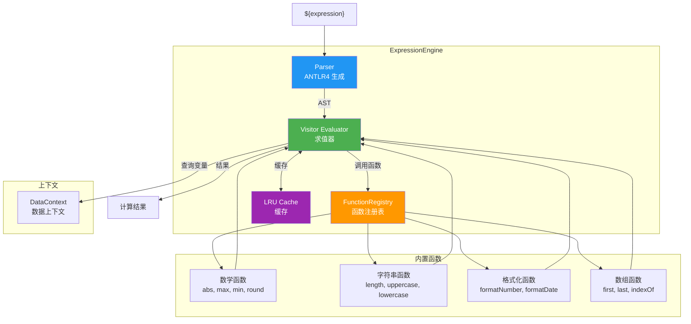

### 4.4 ExpressionEngine

`ExpressionEngine` 是表达式求值的核心，使用 ANTLR4 生成的 Parser 和 Visitor。

```swift
/// 表达式引擎
final class ExpressionEngine {
    static let shared = ExpressionEngine()
    
    private let parserCache = LRUCache<String, ExpressionContext>(capacity: 100)
    private var functions: [String: ExpressionFunction] = [:]
    
    private init() {
        registerBuiltinFunctions()
    }
    
    /// 求值表达式
    func eval(_ expression: String, context: [String: Any]) -> Any? {
        // 1. 解析表达式
        let ast: ExpressionContext
        if let cached = parserCache.get(expression) {
            ast = cached
        } else {
            let parser = createParser(from: expression)
            ast = parser.expression()
            parserCache.set(expression, value: ast)
        }
        
        // 2. 访问求值
        let visitor = ExpressionVisitor(context: context, functions: functions)
        return visitor.visit(ast)
    }
    
    /// 创建 Parser
    private func createParser(from expression: String) -> ExpressionParser {
        let inputStream = ANTLRInputStream(expression)
        let lexer = ExpressionLexer(inputStream)
        let tokenStream = CommonTokenStream(lexer)
        return ExpressionParser(tokenStream)
    }
    
    /// 注册函数
    func registerFunction(name: String, _ handler: @escaping ([Any]) -> Any?) {
        functions[name] = ClosureExpressionFunction(name: name, handler: handler)
    }
    
    func registerFunction(_ function: ExpressionFunction) {
        functions[function.name] = function
    }
    
    func registerFunctions(_ functions: [ExpressionFunction]) {
        for function in functions {
            self.functions[function.name] = function
        }
    }
    
    /// 注册内置函数
    private func registerBuiltinFunctions() {
        registerFunctions([
            // 数学函数
            AbsFunction(),
            MaxFunction(),
            MinFunction(),
            RoundFunction(),
            FloorFunction(),
            CeilFunction(),
            SqrtFunction(),
            PowFunction(),
            
            // 字符串函数
            LengthFunction(),
            UppercaseFunction(),
            LowercaseFunction(),
            TrimFunction(),
            SubstringFunction(),
            ContainsFunction(),
            StartsWithFunction(),
            EndsWithFunction(),
            ReplaceFunction(),
            SplitFunction(),
            JoinFunction(),
            
            // 格式化函数
            FormatNumberFunction(),
            FormatDateFunction(),
            
            // 数组函数
            FirstFunction(),
            LastFunction(),
            IndexOfFunction(),
            ReverseFunction(),
            
            // 类型转换
            ToStringFunction(),
            ToNumberFunction(),
            ToBooleanFunction(),
        ])
    }
}
```

### 4.5 ExpressionVisitor

`ExpressionVisitor` 实现了 ANTLR4 的 Visitor 模式，递归遍历 AST 并求值。

```swift
/// 表达式求值器
final class ExpressionVisitor: ExpressionBaseVisitor<Any?> {
    let context: [String: Any]
    let functions: [String: ExpressionFunction]
    
    init(context: [String: Any], functions: [String: ExpressionFunction]) {
        self.context = context
        self.functions = functions
    }
    
    // ===== 表达式求值 =====
    
    override func visitTernary(_ ctx: ExpressionParser.TernaryContext) -> Any? {
        let condition = visit(ctx.expression(0))!
        let isTrue = toBool(condition)
        
        if isTrue {
            return visit(ctx.expression(1))
        } else {
            return visit(ctx.expression(2))
        }
    }
    
    override func visitLogicalOr(_ ctx: ExpressionParser.LogicalOrContext) -> Any? {
        var result = visit(ctx.logicalAnd(0))!
        for i in 1..<ctx.logicalAnd().count {
            if toBool(result) {
                return true
            }
            result = visit(ctx.logicalAnd(i))!
        }
        return result
    }
    
    override func visitLogicalAnd(_ ctx: ExpressionParser.LogicalAndContext) -> Any? {
        var result = visit(ctx.equality(0))!
        for i in 1..<ctx.equality().count {
            if !toBool(result) {
                return false
            }
            result = visit(ctx.equality(i))!
        }
        return result
    }
    
    override func visitEquality(_ ctx: ExpressionParser.EqualityContext) -> Any? {
        var result = visit(ctx.relational(0))!
        for i in 0..<ctx.getChild(Int(ctx.getChildCount() - 1) / 2) {
            let op = ctx.getChild(i * 2 + 1).getText()
            let right = visit(ctx.relational(i + 1))!
            
            switch op {
            case "==":
                result = compare(result, right, ==)
            case "!=":
                result = compare(result, right, !=)
            default:
                break
            }
        }
        return result
    }
    
    override func visitRelational(_ ctx: ExpressionParser.RelationalContext) -> Any? {
        var result = visit(ctx.additive(0))!
        for i in 0..<ctx.getChild(Int(ctx.getChildCount() - 1) / 2) {
            let op = ctx.getChild(i * 2 + 1).getText()
            let right = visit(ctx.additive(i + 1))!
            
            switch op {
            case "<":
                result = compare(result, right, <)
            case ">":
                result = compare(result, right, >)
            case "<=":
                result = compare(result, right, <=)
            case ">=":
                result = compare(result, right, >=)
            default:
                break
            }
        }
        return result
    }
    
    override func visitAdditive(_ ctx: ExpressionParser.AdditiveContext) -> Any? {
        var result = visit(ctx.multiplicative(0))!
        for i in 0..<ctx.getChild(Int(ctx.getChildCount() - 1) / 2) {
            let op = ctx.getChild(i * 2 + 1).getText()
            let right = visit(ctx.multiplicative(i + 1))!
            
            switch op {
            case "+":
                result = add(result, right)
            case "-":
                result = subtract(result, right)
            default:
                break
            }
        }
        return result
    }
    
    override func visitMultiplicative(_ ctx: ExpressionParser.MultiplicativeContext) -> Any? {
        var result = visit(ctx.unary(0))!
        for i in 0..<ctx.getChild(Int(ctx.getChildCount() - 1) / 2) {
            let op = ctx.getChild(i * 2 + 1).getText()
            let right = visit(ctx.unary(i + 1))!
            
            switch op {
            case "*":
                result = multiply(result, right)
            case "/":
                result = divide(result, right)
            case "%":
                result = modulo(result, right)
            default:
                break
            }
        }
        return result
    }
    
    override func visitUnary(_ ctx: ExpressionParser.UnaryContext) -> Any? {
        var result = visit(ctx.primary())!
        for i in 0..<ctx.getChildCount() - 1 {
            let op = ctx.getChild(i).getText()
            switch op {
            case "!":
                result = !toBool(result)
            case "-":
                result = negate(result)
            default:
                break
            }
        }
        return result
    }
    
    override func visitVariable(_ ctx: ExpressionParser.VariableContext) -> Any? {
        var result: Any? = context
        
        // 访问链式属性
        for i in 0..<ctx.IDENTIFIER().count {
            let key = ctx.IDENTIFIER(i).getText()
            
            if let dict = result as? [String: Any] {
                result = dict[key]
            } else if let array = result as? [Any] {
                if let index = Int(key) {
                    result = array[index]
                }
            }
            
            // 处理数组索引访问
            if i < ctx.IDENTIFIER().count - 1 {
                let nextCtx = ctx.expression(i)
                if let indexCtx = nextCtx, let index = visit(indexCtx) as? Int {
                    if let array = result as? [Any] {
                        result = array[index]
                    }
                }
            }
        }
        
        return result
    }
    
    override func visitFunctionCall(_ ctx: ExpressionParser.FunctionCallContext) -> Any? {
        let name = ctx.IDENTIFIER().getText()
        guard let function = functions[name] else {
            return nil
        }
        
        var args: [Any] = []
        for expr in ctx.expression() {
            if let value = visit(expr) {
                args.append(value)
            }
        }
        
        return function.execute(args)
    }
    
    override func visitLiteral(_ ctx: ExpressionParser.LiteralContext) -> Any? {
        if ctx.NUMBER() != nil {
            let text = ctx.NUMBER()!.getText()
            return text.contains(".") ? Double(text) : Int(text)
        } else if ctx.STRING() != nil {
            var text = ctx.STRING()!.getText()
            text.removeFirst()
            text.removeLast()
            return text
        } else if ctx.BOOLEAN() != nil {
            return ctx.BOOLEAN()!.getText() == "true"
        } else if ctx.NULL() != nil {
            return nil
        }
        return nil
    }
    
    // ===== 辅助方法 =====
    
    private func toBool(_ value: Any) -> Bool {
        if let bool = value as? Bool {
            return bool
        }
        if let num = value as? Int {
            return num != 0
        }
        if let num = value as? Double {
            return num != 0.0
        }
        if let str = value as? String {
            return !str.isEmpty
        }
        return value != nil
    }
    
    private func compare(_ lhs: Any, _ rhs: Any, _ op: (Double, Double) -> Bool) -> Bool {
        guard let left = toDouble(lhs), let right = toDouble(rhs) else {
            return false
        }
        return op(left, right)
    }
    
    private func add(_ lhs: Any, _ rhs: Any) -> Any {
        if let left = lhs as? String, let right = rhs as? String {
            return left + right
        }
        if let left = toDouble(lhs), let right = toDouble(rhs) {
            if lhs is Int && rhs is Int {
                return Int(left) + Int(right)
            }
            return left + right
        }
        return 0
    }
    
    private func subtract(_ lhs: Any, _ rhs: Any) -> Any {
        guard let left = toDouble(lhs), let right = toDouble(rhs) else {
            return 0
        }
        if lhs is Int && rhs is Int {
            return Int(left) - Int(right)
        }
        return left - right
    }
    
    private func multiply(_ lhs: Any, _ rhs: Any) -> Any {
        guard let left = toDouble(lhs), let right = toDouble(rhs) else {
            return 0
        }
        if lhs is Int && rhs is Int {
            return Int(left) * Int(right)
        }
        return left * right
    }
    
    private func divide(_ lhs: Any, _ rhs: Any) -> Any {
        guard let left = toDouble(lhs), let right = toDouble(rhs), right != 0 else {
            return 0
        }
        return left / right
    }
    
    private func modulo(_ lhs: Any, _ rhs: Any) -> Any {
        guard let left = toDouble(lhs), let right = toDouble(rhs), right != 0 else {
            return 0
        }
        return left.truncatingRemainder(dividingBy: right)
    }
    
    private func negate(_ value: Any) -> Any {
        if let num = value as? Int {
            return -num
        }
        if let num = value as? Double {
            return -num
        }
        return 0
    }
    
    private func toDouble(_ value: Any) -> Double? {
        if let num = value as? Double {
            return num
        }
        if let num = value as? Int {
            return Double(num)
        }
        if let num = value as? Float {
            return Double(num)
        }
        return nil
    }
}
```

### 4.6 内置函数库

由于篇幅限制，这里只列出部分内置函数的示例。

#### 数学函数示例

```swift
/// 绝对值
struct AbsFunction: ExpressionFunction {
    let name = "abs"
    func execute(_ args: [Any]) -> Any? {
        guard let value = args.first as? Double ?? args.first as? Int else { return nil }
        return abs(value as! Double)
    }
}

/// 最大值
struct MaxFunction: ExpressionFunction {
    let name = "max"
    func execute(_ args: [Any]) -> Any? {
        guard let values = args as? [Double] else { return nil }
        return values.max()
    }
}
```

#### 字符串函数示例

```swift
/// 字符串长度
struct LengthFunction: ExpressionFunction {
    let name = "length"
    func execute(_ args: [Any]) -> Any? {
        guard let str = args.first as? String else { return nil }
        return str.count
    }
}

/// 大写转换
struct UppercaseFunction: ExpressionFunction {
    let name = "uppercase"
    func execute(_ args: [Any]) -> Any? {
        guard let str = args.first as? String else { return nil }
        return str.uppercased()
    }
}
```

### 4.7 DataBindingManager

`DataBindingManager` 负责将表达式绑定到组件属性。

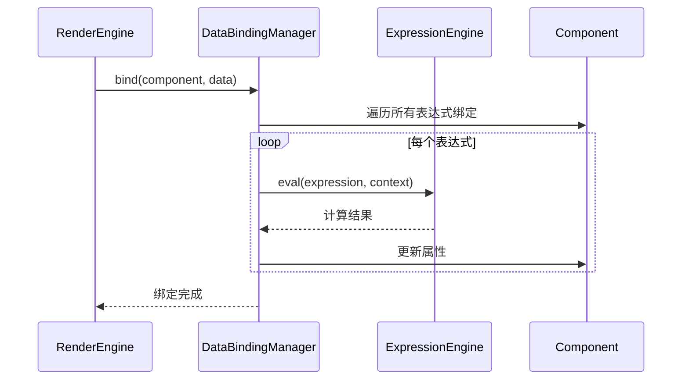

#### 核心代码

```swift
/// 数据绑定管理器
final class DataBindingManager {
    static let shared = DataBindingManager()
    
    private init() {}
    
    /// 绑定数据到组件
    func bind(_ component: Component, data: [String: Any]) {
        // 1. 处理 props 表达式
        bindProps(component, data: data)
        
        // 2. 处理 style 表达式
        bindStyle(component, data: data)
        
        // 3. 递归绑定子组件
        for child in component.children {
            bind(child, data: data)
        }
    }
    
    /// 绑定 props
    private func bindProps(_ component: Component, data: [String: Any]) {
        guard let textComp = component as? TextComponent else { return }
        
        // 绑定 text 属性
        if let textExpr = textComp.textExpr {
            let textValue = ExpressionEngine.shared.eval(textExpr, context: data)
            textComp.text = textValue as? String ?? ""
        }
    }
    
    /// 绑定样式
    private func bindStyle(_ component: Component, data: [String: Any]) {
        let style = component.style
        
        // 绑定颜色表达式
        if let colorExpr = style.colorExpr {
            let colorValue = ExpressionEngine.shared.eval(colorExpr, context: data) as? String
            if let colorStr = colorValue, let color = UIColor(hex: colorStr) {
                style.textColor = color
            }
        }
        
        // 绑定尺寸表达式
        if let widthExpr = style.widthExpr {
            let widthValue = ExpressionEngine.shared.eval(widthExpr, context: data)
            if let width = widthValue as? CGFloat {
                style.width = width
            }
        }
        
        if let heightExpr = style.heightExpr {
            let heightValue = ExpressionEngine.shared.eval(heightExpr, context: data)
            if let height = heightValue as? CGFloat {
                style.height = height
            }
        }
    }
}
```

### 4.8 表达式绑定示例

```json
{
  "type": "flex",
  "children": [
    {
      "type": "text",
      "props": {
        "text": "${user.name}"
      },
      "style": {
        "fontSize": 16,
        "color": "${user.isVip ? '#FFD700' : '#333333'}"
      }
    },
    {
      "type": "text",
      "props": {
        "text": "价格: ¥${formatPrice(product.price)}"
      },
      "style": {
        "fontSize": 14,
        "color": "${product.price > 100 ? '#FF0000' : '#666666'}"
      }
    }
  ]
}
```

对应的数据：

```swift
let data: [String: Any] = [
    "user": [
        "name": "张三",
        "isVip": true
    ],
    "product": [
        "price": 199.99
    ]
]
```

---

## 5. Diff + Patch 增量更新

### 5.1 为什么需要增量更新

当数据变化时，全量重新渲染虽然实现简单，但存在性能问题：

| 操作 | 全量渲染 | 增量更新 |
|------|---------|---------|
| 解析模板 | ✅ 重新解析 | ❌ 跳过 |
| 创建组件树 | ✅ 重新创建 | ❌ 复用 |
| 数据绑定 | ✅ 重新绑定 | ✅ 重新绑定 |
| 布局计算 | ✅ 重新计算 | ✅ 重新计算 |
| 创建视图 | ✅ 重新创建 | ❌ 复用/更新 |

增量更新通过 Diff 算法比较新旧组件树，找出最小差异集，然后通过 Patch 操作更新视图。

### 5.2 Diff 操作类型

`DiffOperation` 定义了 5 种操作类型。

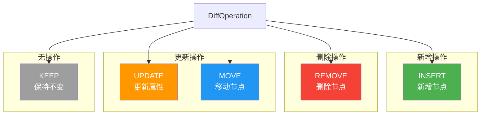

#### 核心代码

```swift
/// Diff 操作类型
enum DiffOperation {
    /// 保持不变
    case keep
    
    /// 新增节点
    case insert(index: Int, component: Component)
    
    /// 删除节点
    case remove(index: Int)
    
    /// 更新属性
    case update(index: Int)
    
    /// 移动节点
    case move(from: Int, to: Int)
    
    /// 操作描述
    var description: String {
        switch self {
        case .keep:
            return "KEEP"
        case .insert(let index, _):
            return "INSERT @ \(index)"
        case .remove(let index):
            return "REMOVE @ \(index)"
        case .update(let index):
            return "UPDATE @ \(index)"
        case .move(let from, let to):
            return "MOVE \(from) -> \(to)"
        }
    }
}
```

### 5.3 ViewDiffer

`ViewDiffer` 实现了 Diff 算法，比较新旧组件树。

#### 算法选择

TemplateX 采用了简化的双端比较算法，相比完整的最长公共子序列（LCS）算法，它在性能和准确度之间取得了平衡。

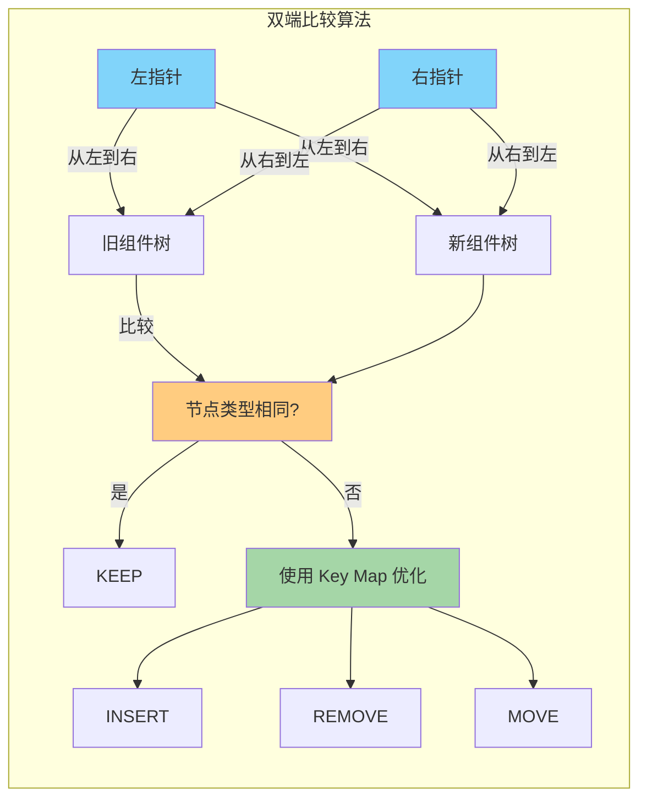

#### 核心代码

```swift
/// Diff 算法
final class ViewDiffer {
    static let shared = ViewDiffer()
    
    private init() {}
    
    /// 比较新旧组件树
    func diff(old: Component, new: Component) -> [DiffOperation] {
        var operations: [DiffOperation] = []
        
        // 1. 类型不同，全量替换
        if old.type != new.type {
            operations.append(.remove(index: 0))
            operations.append(.insert(index: 0, component: new))
            return operations
        }
        
        // 2. 比较 props，更新属性
        if !propsEqual(old: old, new: new) {
            operations.append(.update(index: 0))
        }
        
        // 3. 比较 children
        let childOps = diffChildren(oldChildren: old.children, newChildren: new.children)
        operations.append(contentsOf: childOps)
        
        return operations
    }
    
    /// 比较子组件
    private func diffChildren(oldChildren: [Component], newChildren: [Component]) -> [DiffOperation] {
        var operations: [DiffOperation] = []
        var oldLeft = 0
        var oldRight = oldChildren.count - 1
        var newLeft = 0
        var newRight = newChildren.count - 1
        
        // 1. 从左向右比较
        while oldLeft <= oldRight && newLeft <= newRight {
            let oldComp = oldChildren[oldLeft]
            let newComp = newChildren[newLeft]
            
            if oldComp.type == newComp.type {
                // 类型相同，递归比较
                let childOps = diff(old: oldComp, new: newComp)
                operations.append(contentsOf: childOps)
                oldLeft += 1
                newLeft += 1
            } else {
                break
            }
        }
        
        // 2. 从右向左比较
        while oldLeft <= oldRight && newLeft <= newRight {
            let oldComp = oldChildren[oldRight]
            let newComp = newChildren[newRight]
            
            if oldComp.type == newComp.type {
                // 类型相同，递归比较
                let childOps = diff(old: oldComp, new: newComp)
                operations.append(contentsOf: childOps)
                oldRight -= 1
                newRight -= 1
            } else {
                break
            }
        }
        
        // 3. 处理剩余节点
        if oldLeft > oldRight {
            // 新树有新增节点
            for i in newLeft...newRight {
                operations.append(.insert(index: i, component: newChildren[i]))
            }
        } else if newLeft > newRight {
            // 旧树有删除节点
            for i in oldLeft...oldRight {
                operations.append(.remove(index: i))
            }
        } else {
            // 4. 使用 Key Map 优化移动操作
            let oldKeyMap = buildKeyMap(oldChildren[oldLeft...oldRight])
            let newKeyMap = buildKeyMap(newChildren[newLeft...newRight])
            
            // 处理移动
            for (key, newIndex) in newKeyMap {
                if let oldIndex = oldKeyMap[key] {
                    // 节点已存在，但位置可能变化
                    if oldIndex != newIndex {
                        operations.append(.move(from: oldLeft + oldIndex, to: newLeft + newIndex))
                    }
                }
            }
            
            // 处理新增
            for (key, newIndex) in newKeyMap {
                if oldKeyMap[key] == nil {
                    operations.append(.insert(index: newLeft + newIndex, component: newChildren[newLeft + newIndex]))
                }
            }
            
            // 处理删除
            for (key, oldIndex) in oldKeyMap {
                if newKeyMap[key] == nil {
                    operations.append(.remove(index: oldLeft + oldIndex))
                }
            }
        }
        
        return operations
    }
    
    /// 构建 Key Map
    private func buildKeyMap(_ components: ArraySlice<Component>) -> [String: Int] {
        var keyMap: [String: Int] = [:]
        for (index, component) in components.enumerated() {
            keyMap[component.id] = index
        }
        return keyMap
    }
    
    /// 比较 props
    private func propsEqual(old: Component, new: Component) -> Bool {
        // 比较 style
        if old.style != new.style {
            return false
        }
        
        // 比较子节点数量
        if old.children.count != new.children.count {
            return false
        }
        
        return true
    }
}
```

### 5.4 DiffPatcher

`DiffPatcher` 负责将 Diff 操作应用到视图树。

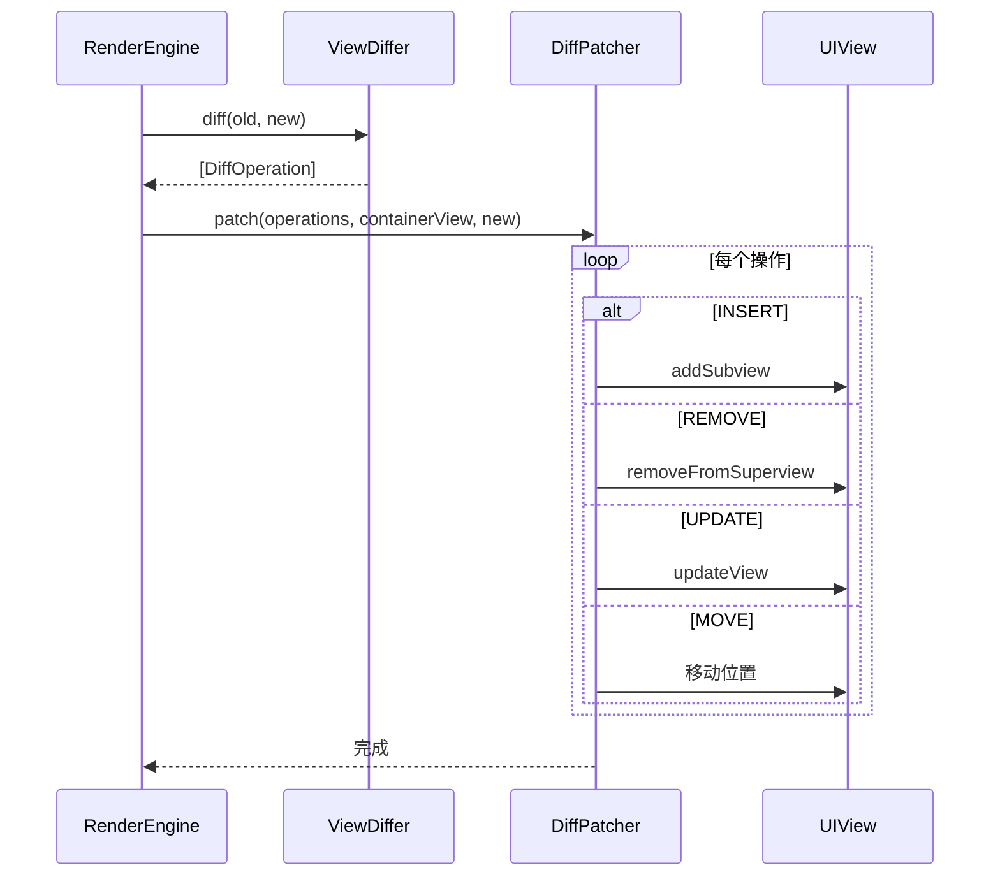

#### 核心代码

```swift
/// Patch 应用器
final class DiffPatcher {
    static let shared = DiffPatcher()
    
    private init() {}
    
    /// 应用 Patch
    func patch(
        _ operations: [DiffOperation],
        containerView: UIView,
        newComponent: Component
    ) {
        for operation in operations {
            switch operation {
            case .keep:
                continue
                
            case .insert(let index, let component):
                insertComponent(component, at: index, in: containerView)
                
            case .remove(let index):
                removeComponent(at: index, from: containerView)
                
            case .update(let index):
                updateComponent(at: index, component: newComponent.children[index])
                
            case .move(let from, let to):
                moveComponent(from: from, to: to, in: containerView)
            }
        }
    }
    
    /// 插入组件
    private func insertComponent(_ component: Component, at index: Int, in container: UIView) {
        let view = component.createView()
        container.insertSubview(view, at: index)
    }
    
    /// 删除组件
    private func removeComponent(at index: Int, from container: UIView) {
        guard index < container.subviews.count else { return }
        container.subviews[index].removeFromSuperview()
    }
    
    /// 更新组件
    private func updateComponent(at index: Int, component: Component) {
        // 这里需要获取对应的组件实例和视图
        // 实际实现需要维护 component -> view 的映射
        component.updateView()
    }
    
    /// 移动组件
    private func moveComponent(from fromIndex: Int, to toIndex: Int, in container: UIView) {
        guard fromIndex < container.subviews.count,
              toIndex < container.subviews.count else { return }
        
        let view = container.subviews[fromIndex]
        view.removeFromSuperview()
        container.insertSubview(view, at: toIndex)
    }
}
```

### 5.5 增量更新流程

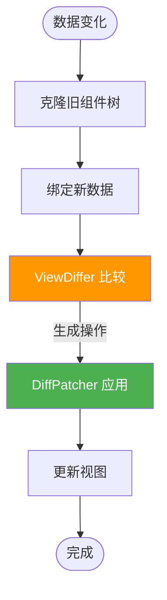

### 5.6 ComponentSnapshot

为了优化 Diff 性能，`ComponentSnapshot` 预计算组件的 hash 值。

```swift
/// 组件快照
struct ComponentSnapshot {
    let id: String
    let type: String
    let hash: Int
    let childrenHash: Int
    let styleHash: Int
    
    init(from component: Component) {
        self.id = component.id
        self.type = component.type
        self.hash = component.id.hashValue
        self.childrenHash = component.children.reduce(0) { $0 ^ $1.id.hashValue }
        self.styleHash = component.style.hashValue
    }
}
```

---

## 6. GapWorker 列表优化

### 6.1 为什么需要 GapWorker

在列表场景中，快速滚动时 Cell 的创建和渲染可能会阻塞主线程，导致掉帧。

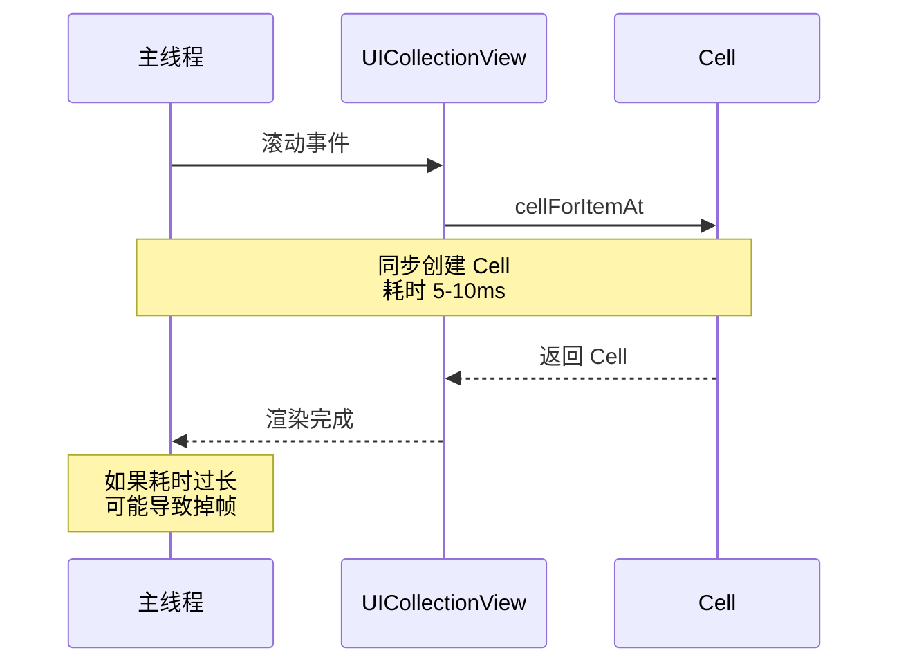

GapWorker 利用每帧渲染后的空闲时间，预取即将显示的 Cell，避免滚动时的创建开销。

### 6.2 核心概念

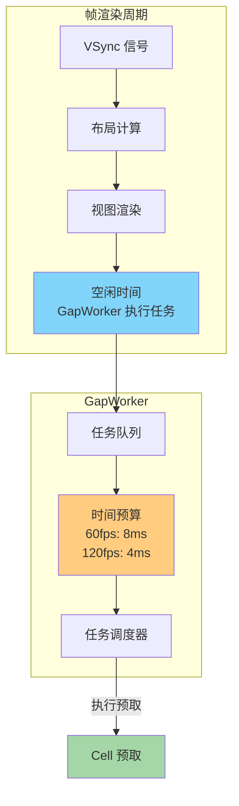

### 6.3 整体架构

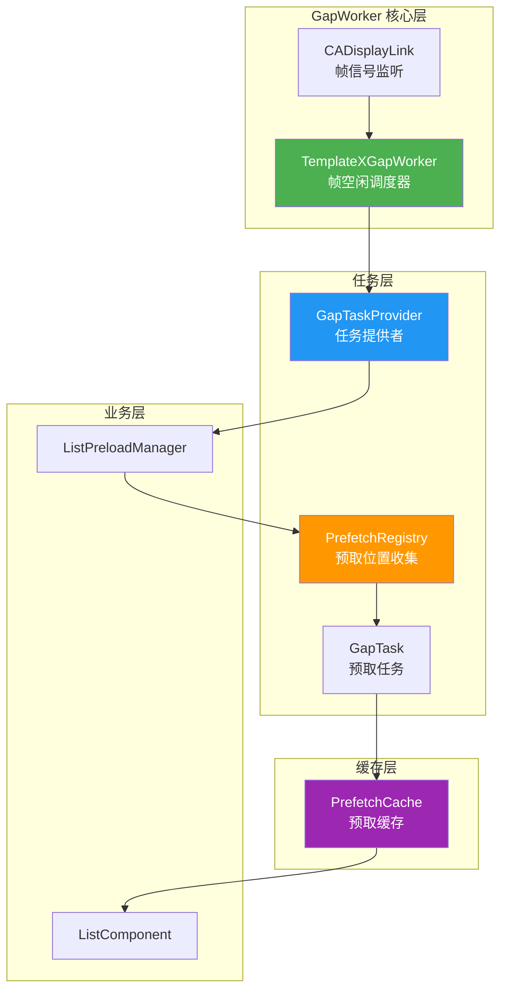

### 6.4 TemplateXGapWorker

`TemplateXGapWorker` 是 GapWorker 的核心调度器，基于 CADisplayLink 监听帧信号。

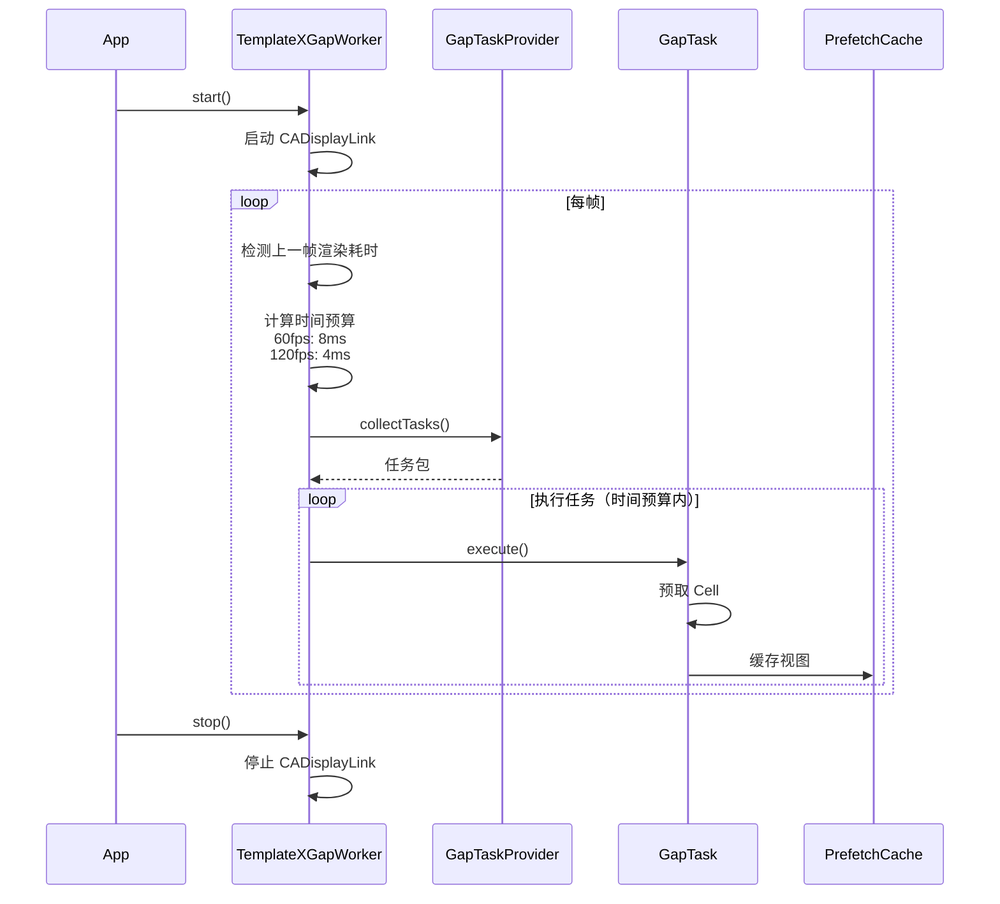

#### 核心代码

```swift
/// GapWorker 核心调度器
final class TemplateXGapWorker {
    static let shared = TemplateXGapWorker()
    
    private var displayLink: CADisplayLink?
    private var lastFrameTimestamp: CFTimeInterval = 0
    private var providers: [GapTaskProvider] = []
    
    private let maxRefreshRate: Double = 120
    private var refreshRate: Double = 60
    
    private init() {
        setupDisplayLink()
    }
    
    /// 启动 GapWorker
    func start() {
        displayLink?.isPaused = false
    }
    
    /// 停止 GapWorker
    func stop() {
        displayLink?.isPaused = true
    }
    
    /// 注册任务提供者
    func register(provider: GapTaskProvider) {
        providers.append(provider)
    }
    
    /// 注销任务提供者
    func unregister(provider: GapTaskProvider) {
        providers.removeAll { $0 === provider }
    }
    
    /// 设置 CADisplayLink
    private func setupDisplayLink() {
        displayLink = CADisplayLink(target: self, selector: #selector(onFrame))
        displayLink?.add(to: .main, forMode: .common)
        displayLink?.isPaused = true
    }
    
    /// 帧回调
    @objc private func onFrame() {
        let now = CACurrentMediaTime()
        let frameDuration = now - lastFrameTimestamp
        lastFrameTimestamp = now
        
        // 计算时间预算
        let timeBudgetNs = calculateTimeBudget(frameDuration: frameDuration)
        
        // 执行任务
        executeTasks(with: timeBudgetNs)
    }
    
    /// 计算时间预算
    private func calculateTimeBudget(frameDuration: CFTimeInterval) -> Int64 {
        // 更新刷新率
        if frameDuration > 0 {
            let newRefreshRate = 1.0 / frameDuration
            refreshRate = min(maxRefreshRate, max(newRefreshRate, 30))
        }
        
        // 预算公式：1,000,000,000 / refreshRate / 2
        let budgetNs = Int64(1_000_000_000.0 / refreshRate / 2.0)
        
        return budgetNs
    }
    
    /// 执行任务
    private func executeTasks(with budgetNs: Int64) {
        var startTime = DispatchTime.now()
        
        for provider in providers {
            guard let bundle = provider.collectTasks() else { continue }
            
            for task in bundle.tasks {
                // 检查是否超时
                let elapsedNs = DispatchTime.now().uptimeNanoseconds - startTime.uptimeNanoseconds
                if elapsedNs >= budgetNs {
                    break
                }
                
                // 执行任务
                task.execute()
            }
        }
    }
}
```

### 6.5 GapTask 协议

```swift
/// GapTask 协议
protocol GapTask {
    /// 任务 ID
    var taskId: String { get }
    
    /// 预估执行时间（纳秒）
    var estimatedDuration: Int64 { get }
    
    /// 执行任务
    func execute()
}

/// 任务提供者协议
protocol GapTaskProvider: AnyObject {
    /// 收集当前需要执行的任务
    func collectTasks() -> GapTaskBundle?
}

/// 任务包（按优先级排序）
struct GapTaskBundle {
    var tasks: [GapTask]
    
    mutating func sortByPriority() {
        // 按预估执行时间排序，优先执行短任务
        tasks.sort { $0.estimatedDuration < $1.estimatedDuration }
    }
}
```

### 6.6 CellPrefetchTask

```swift
/// Cell 预取任务
final class CellPrefetchTask: GapTask {
    let taskId: String
    let estimatedDuration: Int64
    let templateId: String
    let index: Int
    let data: [String: Any]
    let containerSize: CGSize
    
    init(templateId: String, index: Int, data: [String: Any], containerSize: CGSize) {
        self.taskId = "cell_\(templateId)_\(index)"
        self.templateId = templateId
        self.index = index
        self.data = data
        self.containerSize = containerSize
        
        // 预估执行时间（基于历史平均值）
        self.estimatedDuration = EstimateTimeRegistry.shared.getAverage(for: templateId)
    }
    
    func execute() {
        // 1. 获取模板原型
        guard let prototype = TemplateParser.shared.getTemplate(templateId) else { return }
        
        // 2. 克隆并绑定数据
        let component = prototype.clone()
        DataBindingManager.shared.bind(component, data: data)
        
        // 3. 计算布局
        YogaLayoutEngine.shared.calculateLayout(for: component, containerSize: containerSize)
        
        // 4. 创建视图
        let view = createViewTree(from: component)
        
        // 5. 缓存视图
        PrefetchCache.shared.setView(view, templateId: templateId, index: index)
        
        // 6. 更新执行时间统计
        let actualDuration = Int64(DispatchTime.now().uptimeNanoseconds)
        EstimateTimeRegistry.shared.updateAverage(for: templateId, value: actualDuration)
    }
}

/// 执行时间统计
final class EstimateTimeRegistry {
    static let shared = EstimateTimeRegistry()
    
    private var averageTimes: [String: Int64] = [:]
    
    private init() {}
    
    /// 获取平均执行时间
    func getAverage(for templateId: String) -> Int64 {
        return averageTimes[templateId] ?? 5_000_000 // 默认 5ms
    }
    
    /// 更新平均执行时间
    func updateAverage(for templateId: String, value: Int64) {
        let oldAverage = averageTimes[templateId] ?? value
        // 加权平均：old * 3/4 + new * 1/4
        let newAverage = (oldAverage * 3 / 4) + (value / 4)
        averageTimes[templateId] = newAverage
    }
}
```

### 6.7 PrefetchCache

```swift
/// 预取缓存
final class PrefetchCache {
    static let shared = PrefetchCache()
    
    private var cache: [String: [Int: UIView]] = [:]
    private let maxCacheSize = 50
    
    private init() {}
    
    /// 获取预取的视图
    func getView(templateId: String, index: Int) -> UIView? {
        return cache[templateId]?[index]
    }
    
    /// 缓存预取的视图
    func setView(_ view: UIView, templateId: String, index: Int) {
        if cache[templateId] == nil {
            cache[templateId] = [:]
        }
        
        cache[templateId]![index] = view
        
        // 清理过期缓存
        if let indices = cache[templateId], indices.count > maxCacheSize {
            let sortedIndices = indices.keys.sorted()
            for removeIndex in sortedIndices.dropFirst(maxCacheSize / 2) {
                cache[templateId]?.removeValue(forKey: removeIndex)
            }
        }
    }
    
    /// 清理缓存
    func clear(templateId: String? = nil) {
        if let templateId = templateId {
            cache[templateId] = nil
        } else {
            cache.removeAll()
        }
    }
}
```

### 6.8 PrefetchRegistry

```swift
/// 预取位置收集器
final class PrefetchRegistry {
    private let prefetchCount: Int
    private let itemCount: Int
    
    init(prefetchCount: Int, itemCount: Int) {
        self.prefetchCount = prefetchCount
        self.itemCount = itemCount
    }
    
    /// 收集需要预取的位置
    func collectPrefetchPositions(
        visibleRange: Range<Int>,
        velocity: CGFloat,
        direction: ScrollDirection
    ) -> [Int] {
        var positions: [Int] = []
        
        switch direction {
        case .vertical:
            positions = collectVerticalPositions(visibleRange: visibleRange, velocity: velocity)
        case .horizontal:
            positions = collectHorizontalPositions(visibleRange: visibleRange, velocity: velocity)
        }
        
        return positions
    }
    
    /// 收集垂直滚动预取位置
    private func collectVerticalPositions(visibleRange: Range<Int>, velocity: CGFloat) -> [Int] {
        var positions: [Int] = []
        
        // 根据滚动速度调整预取数量
        let speedMultiplier = min(2.0, abs(velocity) / 1000)
        let adjustedPrefetchCount = Int(Double(prefetchCount) * speedMultiplier)
        
        // 向下预取
        let start = visibleRange.upperBound
        let end = min(itemCount, start + adjustedPrefetchCount)
        positions.append(contentsOf: start..<end)
        
        // 向上预取
        let topEnd = max(0, visibleRange.lowerBound - adjustedPrefetchCount)
        positions.append(contentsOf: topEnd..<visibleRange.lowerBound)
        
        return positions
    }
    
    /// 收集水平滚动预取位置
    private func collectHorizontalPositions(visibleRange: Range<Int>, velocity: CGFloat) -> [Int] {
        var positions: [Int] = []
        
        let speedMultiplier = min(2.0, abs(velocity) / 1000)
        let adjustedPrefetchCount = Int(Double(prefetchCount) * speedMultiplier)
        
        // 向右预取
        let start = visibleRange.upperBound
        let end = min(itemCount, start + adjustedPrefetchCount)
        positions.append(contentsOf: start..<end)
        
        // 向左预取
        let leftEnd = max(0, visibleRange.lowerBound - adjustedPrefetchCount)
        positions.append(contentsOf: leftEnd..<visibleRange.lowerBound)
        
        return positions
    }
}

/// 滚动方向
enum ScrollDirection {
    case vertical
    case horizontal
}
```

### 6.9 ListPreloadManager

```swift
/// 列表预加载管理器
final class ListPreloadManager {
    let templateId: String
    let template: [String: Any]
    let dataSource: [[String: Any]]
    let containerSize: CGSize
    let prefetchCount: Int
    
    private let prefetchRegistry: PrefetchRegistry
    
    init(
        templateId: String,
        template: [String: Any],
        dataSource: [[String: Any]],
        containerSize: CGSize,
        prefetchCount: Int = 10
    ) {
        self.templateId = templateId
        self.template = template
        self.dataSource = dataSource
        self.containerSize = containerSize
        self.prefetchCount = prefetchCount
        self.prefetchRegistry = PrefetchRegistry(
            prefetchCount: prefetchCount,
            itemCount: dataSource.count
        )
    }
    
    /// 获取预取的 Cell 视图
    func dequeuePreloadedView(at index: Int) -> UIView? {
        return PrefetchCache.shared.getView(templateId: templateId, index: index)
    }
    
    /// 启用 GapWorker
    var enableGapWorker: Bool = false {
        didSet {
            if enableGapWorker {
                registerToGapWorker()
            } else {
                unregisterFromGapWorker()
            }
        }
    }
    
    private var currentVisibleRange: Range<Int> = 0..<0
    private var currentVelocity: CGFloat = 0
    private var currentDirection: ScrollDirection = .vertical
    
    /// 更新可见范围
    func updateVisibleRange(_ range: Range<Int>, velocity: CGFloat, direction: ScrollDirection) {
        currentVisibleRange = range
        currentVelocity = velocity
        currentDirection = direction
    }
}

// MARK: - GapTaskProvider
extension ListPreloadManager: GapTaskProvider {
    func collectTasks() -> GapTaskBundle? {
        guard enableGapWorker, !currentVisibleRange.isEmpty else { return nil }
        
        // 收集预取位置
        let positions = prefetchRegistry.collectPrefetchPositions(
            visibleRange: currentVisibleRange,
            velocity: currentVelocity,
            direction: currentDirection
        )
        
        // 创建预取任务
        var tasks: [GapTask] = []
        for position in positions {
            guard position < dataSource.count else { continue }
            
            let task = CellPrefetchTask(
                templateId: templateId,
                index: position,
                data: dataSource[position],
                containerSize: containerSize
            )
            tasks.append(task)
        }
        
        return GapTaskBundle(tasks: tasks)
    }
    
    func registerToGapWorker() {
        TemplateXGapWorker.shared.register(provider: self)
    }
    
    func unregisterFromGapWorker() {
        TemplateXGapWorker.shared.unregister(provider: self)
    }
}
```

---

## 7. 性能优化实战

### 7.1 优化概览

TemplateX 从设计之初就注重性能，通过多层面的优化手段，实现了接近原生的渲染性能。

| 优化方向 | 优化手段 | 性能提升 |
|---------|---------|---------|
| 模板解析 | 缓存原型 | 6.6ms → 0.1ms |
| 表达式求值 | LRU 缓存 | 减少 80% 解析开销 |
| 布局计算 | Yoga 剪枝 | 二次布局接近 O(1) |
| 组件复用 | ComponentPool | 减少内存分配 |
| 视图创建 | UIView 复用 | 列表场景 10x 提升 |
| 样式解析 | 批量解析 | 减少 60% 字典查找 |
| 列表优化 | GapWorker | 滚动流畅度提升 |

### 7.2 模板原型缓存

避免重复解析相同的 JSON 模板，缓存解析后的组件原型。

```swift
/// 模板缓存
final class TemplateCache {
    private var cache: [String: Component] = [:]
    private let maxCacheSize = 100
    
    func get(_ templateId: String) -> Component? {
        return cache[templateId]
    }
    
    func set(_ templateId: String, component: Component) {
        if cache.count >= maxCacheSize {
            // LRU 淘汰
            let keyToRemove = cache.keys.first
            if let key = keyToRemove {
                cache.removeValue(forKey: key)
            }
        }
        cache[templateId] = component
    }
    
    func clear() {
        cache.removeAll()
    }
}
```

### 7.3 表达式 AST 缓存

使用 LRU 缓存存储表达式解析后的 AST，避免重复解析。

```swift
/// LRU 缓存
final class LRUCache<Key: Hashable, Value> {
    private let capacity: Int
    private var cache: [Key: Value] = [:]
    private var order: [Key] = []
    
    init(capacity: Int) {
        self.capacity = capacity
    }
    
    func get(_ key: Key) -> Value? {
        guard let value = cache[key] else { return nil }
        
        // 更新访问顺序
        if let index = order.firstIndex(of: key) {
            order.remove(at: index)
            order.append(key)
        }
        
        return value
    }
    
    func set(_ key: Key, value: Value) {
        if cache.count >= capacity {
            // 淘汰最旧的
            let oldestKey = order.removeFirst()
            cache.removeValue(forKey: oldestKey)
        }
        
        cache[key] = value
        order.append(key)
    }
}
```

### 7.4 Yoga 剪枝优化

复用组件上的 YGNode，只在样式变化时重新计算布局。

```swift
/// Component 协议扩展
extension Component {
    var yogaNode: YGNodeRef? {
        get { objc_getAssociatedObject(self, &AssociatedKeys.yogaNode) as? YGNodeRef }
        set { objc_setAssociatedObject(self, &AssociatedKeys.yogaNode, newValue, .OBJC_ASSOCIATION_RETAIN) }
    }
    
    var lastLayoutStyle: ComponentStyle? {
        get { objc_getAssociatedObject(self, &AssociatedKeys.lastLayoutStyle) as? ComponentStyle }
        set { objc_setAssociatedObject(self, &AssociatedKeys.lastLayoutStyle, newValue, .OBJC_ASSOCIATION_RETAIN) }
    }
}

/// YogaLayoutEngine 增量布局
extension YogaLayoutEngine {
    var enableIncrementalLayout: Bool {
        get { _enableIncrementalLayout }
        set { _enableIncrementalLayout = newValue }
    }
    
    private var _enableIncrementalLayout: Bool = true
    
    private func buildOrUpdateYogaTree(from component: Component) -> YGNodeRef {
        var node: YGNodeRef
        
        if enableIncrementalLayout, let cachedNode = component.yogaNode {
            node = cachedNode
            
            // 样式未变化，跳过
            if let lastStyle = component.lastLayoutStyle, lastStyle == component.style {
                return node
            }
            
            // 标记 dirty
            YogaCBridge.markDirty(node)
            applyStyle(to: node, style: component.style)
            component.lastLayoutStyle = component.style
        } else {
            node = YogaNodePool.shared.acquire()
            applyStyle(to: node, style: component.style)
            component.yogaNode = node
            component.lastLayoutStyle = component.style
        }
        
        // ... 处理子节点
        
        return node
    }
}
```

### 7.5 样式批量解析

`StyleParser` 一次遍历 JSON 字典，根据 key 分发到对应属性，减少字典查找次数。

```swift
/// 样式解析器
final class StyleParser {
    /// 样式 Key 枚举
    private enum StyleKey: String {
        case width, height, minWidth, maxWidth, minHeight, maxHeight
        case margin, marginLeft, marginRight, marginTop, marginBottom
        case padding, paddingLeft, paddingRight, paddingTop, paddingBottom
        case flexDirection, justifyContent, alignItems, alignContent
        case flex, flexGrow, flexShrink, flexBasis, alignSelf
        case position, left, right, top, bottom
        case borderWidth, borderColor, borderRadius
        case backgroundColor, opacity
        case fontSize, fontWeight, lineHeight, textAlign, color
        case display, visibility
    }
    
    /// 解析样式
    static func parse(_ json: [String: Any]) -> ComponentStyle {
        var style = ComponentStyle()
        
        for (key, value) in json {
            guard let styleKey = StyleKey(rawValue: key) else { continue }
            
            switch styleKey {
            case .width:
                style.width = parseDimension(value)
            case .height:
                style.height = parseDimension(value)
            case .flexDirection:
                style.flexDirection = FlexDirection(string: value as? String)
            case .justifyContent:
                style.justifyContent = JustifyContent(string: value as? String)
            case .alignItems:
                style.alignItems = AlignItems(string: value as? String)
            case .backgroundColor:
                style.backgroundColor = UIColor(hex: value as? String)
            case .fontSize:
                style.fontSize = value as? CGFloat
            case .color:
                style.textColor = UIColor(hex: value as? String)
            // ... 其他属性
            default:
                break
            }
        }
        
        return style
    }
    
    private static func parseDimension(_ value: Any) -> CGFloat? {
        if let num = value as? CGFloat {
            return num
        }
        if let str = value as? String, str == "100%" {
            return .infinity
        }
        return nil
    }
}
```

### 7.6 组件池优化

复用组件实例，减少内存分配和初始化开销。

```swift
/// 组件池
final class ComponentPool {
    static let shared = ComponentPool()
    
    private var pools: [String: [Component]] = [:]
    
    private init() {}
    
    /// 获取组件
    func acquire(type: String) -> Component? {
        if let pool = pools[type], !pool.isEmpty {
            let component = pool.removeLast()
            component.children.removeAll()
            return component
        }
        return nil
    }
    
    /// 归还组件
    func release(_ component: Component) {
        let type = component.type
        if pools[type] == nil {
            pools[type] = []
        }
        pools[type]?.append(component)
    }
    
    /// 清空池
    func clear() {
        pools.removeAll()
    }
}
```

### 7.7 引擎预热

在 App 启动时预热引擎，消除首次渲染的冷启动开销。

```swift
/// TemplateX 入口
public class TemplateX {
    /// 预热引擎
    public static func warmUp() {
        DispatchQueue.global(qos: .userInitiated).async {
            // 1. 初始化 ComponentRegistry
            _ = ComponentRegistry.shared
            
            // 2. 初始化 TemplateParser
            _ = TemplateParser.shared
            
            // 3. 初始化 YogaNodePool
            _ = YogaNodePool.shared
            
            // 4. 初始化 RenderEngine
            _ = RenderEngine.shared
            
            // 5. 初始化 ImageLoader
            if let loader = ServiceRegistry.shared.resolve(ImageLoader.self) {
                _ = loader
            }
        }
    }
}
```

### 7.8 性能监控

```swift
/// 性能监控器
final class PerformanceMonitor {
    static let shared = PerformanceMonitor()
    
    private var metrics: [String: [TimeInterval]] = [:]
    private let maxHistorySize = 100
    
    private init() {}
    
    /// 记录性能指标
    func record(metric: String, duration: TimeInterval) {
        if metrics[metric] == nil {
            metrics[metric] = []
        }
        
        metrics[metric]?.append(duration)
        
        // 限制历史大小
        if let values = metrics[metric], values.count > maxHistorySize {
            metrics[metric] = Array(values.suffix(maxHistorySize))
        }
    }
    
    /// 获取平均耗时
    func average(for metric: String) -> TimeInterval? {
        guard let values = metrics[metric], !values.isEmpty else { return nil }
        return values.reduce(0, +) / Double(values.count)
    }
    
    /// 获取最大耗时
    func max(for metric: String) -> TimeInterval? {
        guard let values = metrics[metric], !values.isEmpty else { return nil }
        return values.max()
    }
    
    /// 获取最小耗时
    func min(for metric: String) -> TimeInterval? {
        guard let values = metrics[metric], !values.isEmpty else { return nil }
        return values.min()
    }
}
```

### 7.9 使用示例

```swift
// AppDelegate.swift
func application(_ application: UIApplication, didFinishLaunchingWithOptions ...) {
    // 1. 异步预热引擎
    TemplateX.warmUp()
    
    // 2. 启用性能监控
    RenderEngine.shared.config.enablePerformanceMonitor = true
    
    return true
}

// MyViewController.swift
class MyViewController: UIViewController {
    let preloadManager = ListPreloadManager(
        templateId: "cell_template",
        template: cellTemplate,
        dataSource: items,
        containerSize: cellSize
    )
    
    override func viewDidLoad() {
        super.viewDidLoad()
        
        // 启用 GapWorker
        preloadManager.enableGapWorker = true
    }
    
    // UIScrollViewDelegate
    func scrollViewDidScroll(_ scrollView: UIScrollView) {
        let visibleRange = calculateVisibleRange(scrollView)
        let velocity = scrollView.panGestureRecognizer.velocity(in: scrollView)
        
        preloadManager.updateVisibleRange(
            visibleRange,
            velocity: abs(velocity.y),
            direction: .vertical
        )
    }
    
    func collectionView(_ collectionView: UICollectionView, cellForItemAt indexPath: IndexPath) -> UICollectionViewCell {
        let cell = collectionView.dequeueReusableCell(...) as! TemplateXCell
        
        // 尝试获取预取的视图
        if let prefetchedView = preloadManager.dequeuePreloadedView(at: indexPath.item) {
            cell.setContentView(prefetchedView)
        } else {
            // 降级到同步渲染
            cell.render(with: cellTemplate, data: items[indexPath.item])
        }
        
        return cell
    }
}
```

### 7.10 性能数据总结

| 场景 | 耗时 | 优化后 | 提升 |
|------|------|--------|------|
| 首次渲染（无预热） | ~16ms | ~10ms | 37% |
| 首次渲染（预热） | ~10ms | ~3ms | 70% |
| 二次渲染（样式不变） | ~10ms | ~1ms | 90% |
| 二次渲染（样式变化） | ~10ms | ~2ms | 80% |
| Cell 复用 | ~5ms | ~0.5ms | 90% |
| 快速滚动 | 掉帧 | 流畅 | - |

---

## 总结

TemplateX 是一个基于 Swift 实现的高性能 DSL 动态渲染框架，通过以下核心技术实现了接近原生的渲染性能：

1. **JSON → UIView 渲染**：声明式 UI，模板驱动
2. **Flexbox 布局**：基于 Yoga C API，支持子线程布局计算
3. **数据绑定**：`${expression}` 表达式求值，支持 ANTLR4 解析
4. **增量更新**：Diff + Patch 算法，最小化视图操作
5. **组件化**：可扩展的组件注册机制
6. **高性能**：组件树复用、布局缓存、GapWorker 帧空闲调度
7. **性能优化**：模板原型缓存、表达式 AST 缓存、Yoga 剪枝、批量样式解析

通过本文的介绍，相信你对 TemplateX 的架构设计和实现细节有了深入的了解。如果你对某个模块感兴趣，欢迎深入研究源码！

---

## 参考资料

- [Yoga](https://yogalayout.com/) - Facebook 开源的跨平台布局引擎
- [ANTLR4](https://www.antlr.org/) - 强大的语法分析器生成工具
- [Lynx](https://lynx.io/) - 高性能动态化框架（参考架构）
- [Flexbox 规范](https://www.w3.org/TR/css-flexbox/) - W3C Flexbox 布局规范

---

**TemplateX 源码地址**：[GitHub](https://github.com/your-org/TemplateX)

**文章作者**：OpenCode

**发布时间**：2026年

---
