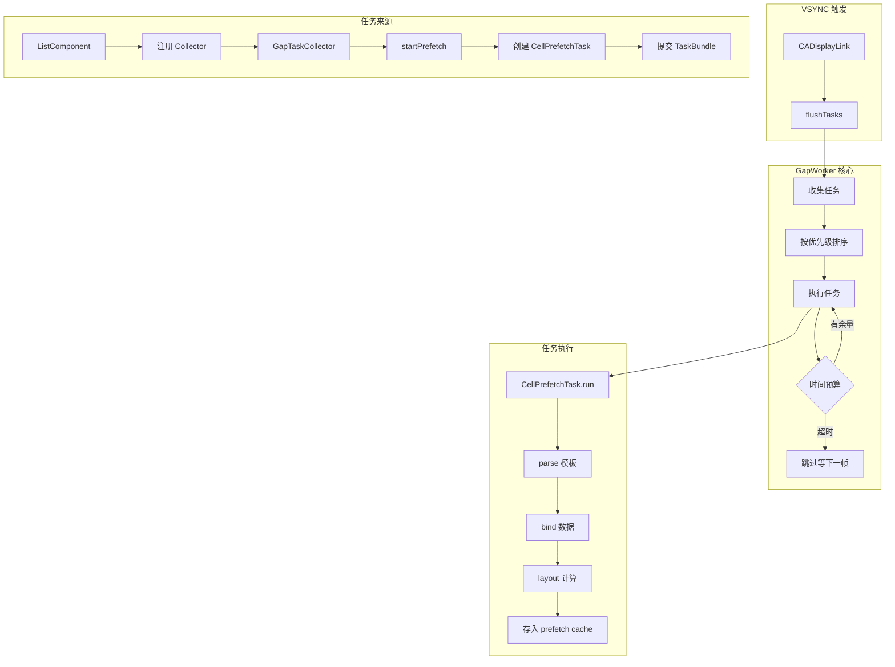
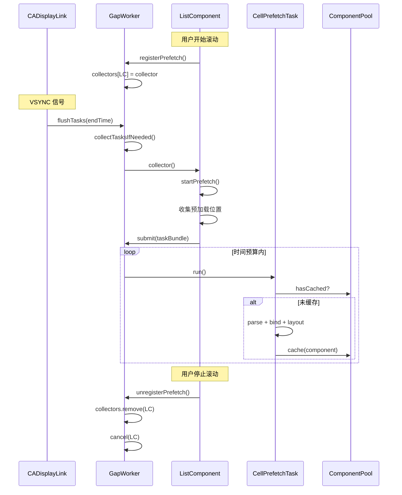

# TemplateX GapWorker 设计文档

## 概述

本文档描述 TemplateX 的 GapWorker 机制，100% 借鉴 Lynx 的实现方案。

GapWorker 是一个**闲时任务调度器**，在每帧渲染完成后的空闲时间内执行 Cell 预渲染任务，确保：
- 不影响主线程渲染性能
- 60fps / 120fps 稳定不掉帧
- 预加载即将进入屏幕的 Cell

---

## 架构设计

### 整体架构



### 与 Lynx 的对应关系

| Lynx 组件 | TemplateX 组件 | 源码位置 |
|-----------|---------------|---------|
| `GapWorker` | `TemplateXGapWorker` | `clay/ui/common/gap_worker.h` |
| `GapTask` | `GapTask` 协议 | `clay/ui/common/gap_task.h` |
| `GapTaskBundle` | `GapTaskBundle` | `clay/ui/common/gap_task.h` |
| `ListPrefetchTask` | `CellPrefetchTask` | `clay/ui/component/list/base_list_view.h:354` |
| `LayoutPrefetchRegistry` | `PrefetchRegistry` | `clay/ui/component/list/base_list_view.h:44` |
| `ListRecycler` | `ComponentPool` | `clay/ui/component/list/list_recycler.h` |
| `ListAdapter.GetAverageBindTime()` | `PerformanceMonitor` | `clay/ui/component/list/list_adapter.cc:109` |
| `PageView.FlushGapTaskIfNecessary()` | `TemplateX.vsyncCallback()` | `clay/ui/component/page_view.cc:1868` |

---

## 核心组件

### 1. TemplateXGapWorker

**对应 Lynx**: `clay/ui/common/gap_worker.h`

核心调度器，负责：
- 管理任务收集器（collectors）
- 管理任务队列（taskMap）
- 在 VSYNC 回调中执行任务

#### 关键属性

| 属性 | Lynx 对应 | 说明 |
|------|----------|------|
| `maxEstimateDuration` | `max_estimate_duration_` | 每帧时间预算（纳秒） |
| `collectors` | `collectors_` | 任务收集器 [host -> collector] |
| `taskMap` | `task_map_` | 任务队列 [host -> taskBundle] |
| `lastTaskList` | `last_task_list_` | 上一帧的任务列表（已排序） |
| `dataChanged` | `data_changed_` | 数据是否变化（需重新排序） |

#### 时间预算计算

```
maxEstimateDuration = 1,000,000,000 / refreshRate / 2
```

| 刷新率 | 时间预算 |
|--------|---------|
| 60fps | 8.33ms |
| 120fps | 4.17ms |

#### 核心方法

**`flushTasks(endTime:)`** - 对应 Lynx `FlushTask()`

```
1. 调用 collectTasksIfNeeded() 收集任务
2. 如果 taskMap 为空，直接返回
3. 如果数据变化，重新排序 lastTaskList
4. 遍历 lastTaskList，执行任务：
   - 检查时间预算
   - 时间不够且不强制执行 → 跳过
   - 执行 task.run()
   - 更新剩余时间
```

---

### 2. GapTask 协议

**对应 Lynx**: `clay/ui/common/gap_task.h`

任务协议定义：

| 属性 | Lynx 对应 | 说明 |
|------|----------|------|
| `taskId` | `id_` | 任务 ID（通常是 Cell position） |
| `estimateDuration` | `estimate_time_` | 估算耗时（纳秒） |
| `priority` | `priority_` | 优先级（距离越小越高） |
| `enableForceRun` | `enable_force_run_` | 是否强制执行 |

---

### 3. GapTaskBundle

**对应 Lynx**: `clay/ui/common/gap_task.h:56`

任务组，管理一组相关的任务：

```
tasks: [GapTask]     // 任务列表
priority: Int        // 最小优先级
host: weak AnyObject // 宿主对象（弱引用）
```

#### Lynx 引用计数

Lynx 使用 `fml::RefPtr<GapTaskBundle>` 管理生命周期，Swift 使用 ARC 自动管理。

---

### 4. PrefetchRegistry

**对应 Lynx**: `clay/ui/component/list/base_list_view.h:44`

预加载位置收集器：

```
prefetchItemInfos: [position: distance]
```

#### 收集逻辑

由 LayoutManager 实现，根据滚动方向收集即将进入屏幕的 Cell 位置。

**Lynx 实现位置**: `list_layout_manager_linear.cc:1058`

```cpp
void ListLayoutManagerLinear::CollectPrefetchPositionsForScrolling(...) {
    // 只在 item 即将进入视口时预加载
    layout_prefetch_registry->AddPosition(position, scrolling_offset);
}
```

---

### 5. CellPrefetchTask

**对应 Lynx**: `clay/ui/component/list/base_list_view.h:354`

Cell 预渲染任务：

```swift
func run() {
    // 1. 检查是否已缓存
    if ComponentPool.shared.hasCached(...) { return }
    
    // 2. Parse 模板
    let component = TemplateParser.shared.parse(...)
    
    // 3. Bind 数据
    DataBindingManager.shared.bind(...)
    
    // 4. Layout 计算
    YogaLayoutEngine.shared.calculateLayout(...)
    
    // 5. 标记 prefetch 并缓存
    component.flags.insert(.prefetch)
    ComponentPool.shared.cache(...)
}
```

**Lynx 实现位置**: `base_list_view.cc:75`

```cpp
void BaseListView::ListPrefetchTask::Run() {
    if (host_view_) {
        auto list_view = static_cast<BaseListView*>(host_view_.get());
        ListRecycler* recycler = list_view->recycler_.get();
        if (recycler->HasItemCached(id_)) {
            return;
        }
        ListItemViewHolder* view_holder = recycler->GetItemForPosition(id_);
        if (view_holder && view_holder->IsBound() && !view_holder->IsInvalid()) {
            view_holder->AddFlags(ListItemViewHolder::Flag::kFlagPrefetch);
            recycler->RecycleItem(view_holder);
        }
    }
}
```

---

## 触发机制

### 1. VSYNC 回调

**对应 Lynx**: `clay/ui/component/page_view.cc:1868`

```cpp
void PageView::FlushGapTaskIfNecessary(const fml::TimePoint& target_end_time) {
    if (GetGapWorker()->HasGapTask() && fml::TimePoint::Now() < target_end_time) {
        task_runners_.GetUITaskRunner()->PostTask([...] {
            page->GetGapWorker()->FlushTask(target_end_time);
            if (page->GetGapWorker()->HasGapTask()) {
                page->RequestNewFrame();
            }
        });
    }
}
```

**TemplateX 实现**: 使用 `CADisplayLink` 替代 Lynx 的 TaskRunner

### 2. 注册/取消注册时机

**对应 Lynx**: `clay/ui/component/list/base_list_view.cc:1272`

```cpp
void BaseListView::SetScrollStatus(ScrollStatus status) {
    bool need_prefetch = status_ == kFling || status_ == kDragging || status_ == kAnimating;
    bool old_need_prefetch = old_status == kFling || old_status == kDragging || old_status == kAnimating;
    
    if (need_prefetch && !old_need_prefetch) {
        RegisterPrefetch();
    } else if (!need_prefetch && old_need_prefetch) {
        UnregisterPrefetch();
    }
}
```

| 滚动状态 | 操作 |
|---------|------|
| 开始拖拽 | RegisterPrefetch() |
| Fling 开始 | 保持注册 |
| 停止滚动 | UnregisterPrefetch() |

### 3. 任务收集

**对应 Lynx**: `clay/ui/component/list/base_list_view.cc:735`

```cpp
void BaseListView::StartPrefetch(int32_t width, int32_t height) {
    // 避免重复提交
    if (last_add_item_position_when_prefetch_start_ == last_add_item_position_) {
        return;
    }
    
    // 清空旧任务
    gap_task_bundle_->Clear();
    
    // 收集预加载位置
    prefetch_registry_.ClearPrefetchPositions();
    prefetch_registry_.CollectPrefetchPostionFromView(this, -width, -height);
    
    // 创建任务
    for (const auto& item_info : prefetch_registry_.prefetch_item_infos_) {
        auto task = std::make_unique<ListPrefetchTask>(
            GetWeakPtr(), 
            item_info.first,  // position
            adapter_->GetAverageBindTime(type).ToNanoseconds(),  // estimate_time
            distance_to_item,  // priority
            true  // enable_force_run
        );
        gap_task_bundle_->AddTask(std::move(task));
    }
    
    // 排序并提交
    gap_task_bundle_->sort();
    page_view_->GetGapWorker()->SubmitTask(gap_task_bundle_);
}
```

---

## 缓存策略

### 1. 两级缓存

**对应 Lynx**: `clay/ui/component/list/list_recycler.h`

| 缓存层级 | Lynx 名称 | 说明 |
|---------|----------|------|
| 1st cache | `attached_scrap_items_` | 即将复用的组件（同一布局周期） |
| 2nd cache | `cached_items_` | 预加载的组件（prefetch） |

### 2. 缓存上限

**对应 Lynx**: `list_recycler.h:71`

```cpp
void SetCacheMaxLimit(int max_limit) { max_limit_ = max_limit; }
int GetCacheMaxLimit() const { return max_limit_; }
```

### 3. 组件标记

**对应 Lynx**: `list_item_view_holder.h:57`

```cpp
enum Flag {
    kFlagBound = 1 << 0,
    kFlagUpdate = 1 << 1,
    kFlagInvalid = 1 << 2,
    kFlagPrefetch = 1 << 3,  // 预加载标记
    // ...
};
```

---

## 性能统计

### 平均绑定时间

**对应 Lynx**: `clay/ui/component/list/list_adapter.cc:17`

使用加权平均计算：

```cpp
int64_t CalculateAverage(int64_t old_average, int64_t new_value) {
    if (old_average == 0) {
        return new_value;
    }
    return (old_average * 3 / 4) + (new_value / 4);
}
```

公式：`新平均 = 旧平均 * 0.75 + 新值 * 0.25`

---

## 时序图



---

## 文件结构

```
TemplateX/Sources/
├── Core/
│   ├── GapWorker/
│   │   ├── TemplateXGapWorker.swift         # 核心调度器
│   │   ├── GapTask.swift                    # 任务协议 + TaskBundle
│   │   ├── PrefetchRegistry.swift           # 预加载位置收集器
│   │   └── CellPrefetchTask.swift           # Cell 预渲染任务
│   ├── Cache/
│   │   └── ComponentPool.swift              # 增强：支持 prefetch cache
│   └── Performance/
│       └── PerformanceMonitor.swift         # 增强：统计 averageBindTime
├── Components/
│   ├── Component.swift                      # 增强：添加 flags 属性
│   └── Views/
│       └── ListComponent.swift              # 集成 GapWorker
└── TemplateX.swift                          # 添加 VSYNC 回调
```

---

## 关键配置

| 配置项 | 默认值 | Lynx 对应 | 说明 |
|--------|-------|----------|------|
| 刷新率 | 60fps / 120fps | `refresh_rate` | 自动检测 ProMotion |
| 时间预算 | 8ms / 4ms | `max_estimate_duration_` | 每帧可用时间 |
| 缓存上限 | 30 | `max_limit_` | 每种模板的最大缓存数 |
| 预加载缓冲 | 3 | `preloadBufferCount` | 预加载的 Cell 数量 |

---

## 参考资料

### Lynx 源码位置

| 文件 | 说明 |
|------|------|
| `clay/ui/common/gap_worker.h` | GapWorker 头文件 |
| `clay/ui/common/gap_worker.cc` | GapWorker 实现 |
| `clay/ui/common/gap_task.h` | GapTask 和 GapTaskBundle |
| `clay/ui/component/list/base_list_view.h` | ListPrefetchTask 和 PrefetchRegistry |
| `clay/ui/component/list/base_list_view.cc` | 预加载逻辑实现 |
| `clay/ui/component/list/list_recycler.h` | 缓存管理 |
| `clay/ui/component/list/list_adapter.cc` | 平均耗时统计 |
| `clay/ui/component/page_view.cc` | VSYNC 触发点 |

### 关键行号

| 功能 | 文件:行号 |
|------|----------|
| FlushTask | `gap_worker.cc:52` |
| ListPrefetchTask::Run | `base_list_view.cc:75` |
| StartPrefetch | `base_list_view.cc:735` |
| RegisterPrefetch | `base_list_view.cc:719` |
| SetScrollStatus | `base_list_view.cc:1272` |
| CalculateAverage | `list_adapter.cc:17` |
| FlushGapTaskIfNecessary | `page_view.cc:1868` |
