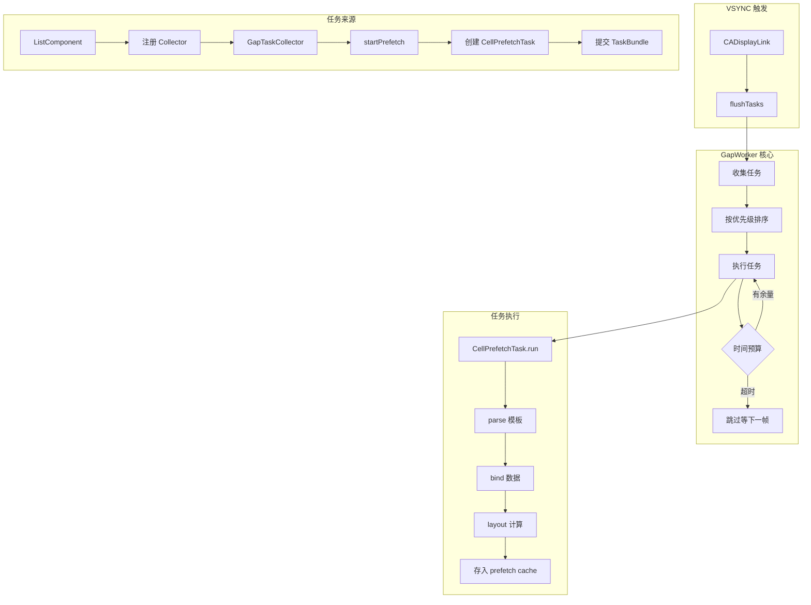
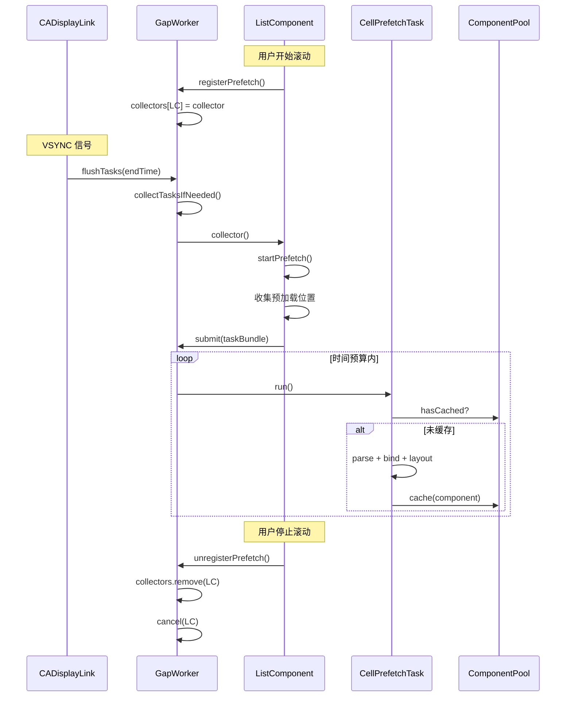

# TemplateX GapWorker 设计文档

## 概述

本文档描述 TemplateX 的 GapWorker 机制，100% 借鉴 Lynx 的实现方案。

GapWorker 是一个**闲时任务调度器**，在每帧渲染完成后的空闲时间内执行 Cell 预渲染任务，确保：
- 不影响主线程渲染性能
- 60fps / 120fps 稳定不掉帧
- 预加载即将进入屏幕的 Cell

---

## 架构设计

### 整体架构


```mermaid
graph TB
    subgraph "VSYNC 触发"
        CADisplayLink[CADisplayLink] --> FlushTasks[flushTasks]
    end
    
    subgraph "GapWorker 核心"
        FlushTasks --> Collect[收集任务]
        Collect --> Sort[按优先级排序]
        Sort --> Execute[执行任务]
        Execute --> CheckTime{时间预算}
        CheckTime -->|有余量| Execute
        CheckTime -->|超时| Skip[跳过等下一帧]
    end
    
    subgraph "任务来源"
        ListComponent[ListComponent] --> Register[注册 Collector]
        Register --> Collector[GapTaskCollector]
        Collector --> StartPrefetch[startPrefetch]
        StartPrefetch --> CreateTasks[创建 CellPrefetchTask]
        CreateTasks --> Submit[提交 TaskBundle]
    end
    
    subgraph "任务执行"
        Execute --> CellPrefetchTask[CellPrefetchTask.run]
        CellPrefetchTask --> Parse[parse 模板]
        Parse --> Bind[bind 数据]
        Bind --> Layout[layout 计算]
        Layout --> Cache[存入 prefetch cache]
    end
```

### 与 Lynx 的对应关系

| Lynx 组件 | TemplateX 组件 | 源码位置 |
|-----------|---------------|---------|
| `GapWorker` | `TemplateXGapWorker` | `clay/ui/common/gap_worker.h` |
| `GapTask` | `GapTask` 协议 | `clay/ui/common/gap_task.h` |
| `GapTaskBundle` | `GapTaskBundle` | `clay/ui/common/gap_task.h` |
| `ListPrefetchTask` | `CellPrefetchTask` | `clay/ui/component/list/base_list_view.h:354` |
| `LayoutPrefetchRegistry` | `PrefetchRegistry` | `clay/ui/component/list/base_list_view.h:44` |
| `ListRecycler` | `ComponentPool` | `clay/ui/component/list/list_recycler.h` |
| `ListAdapter.GetAverageBindTime()` | `PerformanceMonitor` | `clay/ui/component/list/list_adapter.cc:109` |
| `PageView.FlushGapTaskIfNecessary()` | `TemplateX.vsyncCallback()` | `clay/ui/component/page_view.cc:1868` |

---

## 核心组件

### 1. TemplateXGapWorker

**对应 Lynx**: `clay/ui/common/gap_worker.h`

核心调度器，负责：
- 管理任务收集器（collectors）
- 管理任务队列（taskMap）
- 在 VSYNC 回调中执行任务

#### 关键属性

| 属性 | Lynx 对应 | 说明 |
|------|----------|------|
| `maxEstimateDuration` | `max_estimate_duration_` | 每帧时间预算（纳秒） |
| `collectors` | `collectors_` | 任务收集器 [host -> collector] |
| `taskMap` | `task_map_` | 任务队列 [host -> taskBundle] |
| `lastTaskList` | `last_task_list_` | 上一帧的任务列表（已排序） |
| `dataChanged` | `data_changed_` | 数据是否变化（需重新排序） |

#### 时间预算计算

```
maxEstimateDuration = 1,000,000,000 / refreshRate / 2
```

| 刷新率 | 时间预算 |
|--------|---------|
| 60fps | 8.33ms |
| 120fps | 4.17ms |

#### 核心方法

**`flushTasks(endTime:)`** - 对应 Lynx `FlushTask()`

```
1. 调用 collectTasksIfNeeded() 收集任务
2. 如果 taskMap 为空，直接返回
3. 如果数据变化，重新排序 lastTaskList
4. 遍历 lastTaskList，执行任务：
   - 检查时间预算
   - 时间不够且不强制执行 → 跳过
   - 执行 task.run()
   - 更新剩余时间
```

---

### 2. GapTask 协议

**对应 Lynx**: `clay/ui/common/gap_task.h`

任务协议定义：

| 属性 | Lynx 对应 | 说明 |
|------|----------|------|
| `taskId` | `id_` | 任务 ID（通常是 Cell position） |
| `estimateDuration` | `estimate_time_` | 估算耗时（纳秒） |
| `priority` | `priority_` | 优先级（距离越小越高） |
| `enableForceRun` | `enable_force_run_` | 是否强制执行 |

---

### 3. GapTaskBundle

**对应 Lynx**: `clay/ui/common/gap_task.h:56`

任务组，管理一组相关的任务：

```
tasks: [GapTask]     // 任务列表
priority: Int        // 最小优先级
host: weak AnyObject // 宿主对象（弱引用）
```

#### Lynx 引用计数

Lynx 使用 `fml::RefPtr<GapTaskBundle>` 管理生命周期，Swift 使用 ARC 自动管理。

---

### 4. PrefetchRegistry

**对应 Lynx**: `clay/ui/component/list/base_list_view.h:44`

预加载位置收集器：

```
prefetchItemInfos: [position: distance]
```

#### 收集逻辑

由 LayoutManager 实现，根据滚动方向收集即将进入屏幕的 Cell 位置。

**Lynx 实现位置**: `list_layout_manager_linear.cc:1058`

```cpp
void ListLayoutManagerLinear::CollectPrefetchPositionsForScrolling(...) {
    // 只在 item 即将进入视口时预加载
    layout_prefetch_registry->AddPosition(position, scrolling_offset);
}
```

---

### 5. CellPrefetchTask

**对应 Lynx**: `clay/ui/component/list/base_list_view.h:354`

Cell 预渲染任务：

```swift
func run() {
    // 1. 检查是否已缓存
    if ComponentPool.shared.hasCached(...) { return }
    
    // 2. Parse 模板
    let component = TemplateParser.shared.parse(...)
    
    // 3. Bind 数据
    DataBindingManager.shared.bind(...)
    
    // 4. Layout 计算
    YogaLayoutEngine.shared.calculateLayout(...)
    
    // 5. 标记 prefetch 并缓存
    component.flags.insert(.prefetch)
    ComponentPool.shared.cache(...)
}
```

**Lynx 实现位置**: `base_list_view.cc:75`

```cpp
void BaseListView::ListPrefetchTask::Run() {
    if (host_view_) {
        auto list_view = static_cast<BaseListView*>(host_view_.get());
        ListRecycler* recycler = list_view->recycler_.get();
        if (recycler->HasItemCached(id_)) {
            return;
        }
        ListItemViewHolder* view_holder = recycler->GetItemForPosition(id_);
        if (view_holder && view_holder->IsBound() && !view_holder->IsInvalid()) {
            view_holder->AddFlags(ListItemViewHolder::Flag::kFlagPrefetch);
            recycler->RecycleItem(view_holder);
        }
    }
}
```

---

## 触发机制

### 1. VSYNC 回调

**对应 Lynx**: `clay/ui/component/page_view.cc:1868`

```cpp
void PageView::FlushGapTaskIfNecessary(const fml::TimePoint& target_end_time) {
    if (GetGapWorker()->HasGapTask() && fml::TimePoint::Now() < target_end_time) {
        task_runners_.GetUITaskRunner()->PostTask([...] {
            page->GetGapWorker()->FlushTask(target_end_time);
            if (page->GetGapWorker()->HasGapTask()) {
                page->RequestNewFrame();
            }
        });
    }
}
```

**TemplateX 实现**: 使用 `CADisplayLink` 替代 Lynx 的 TaskRunner

### 2. 注册/取消注册时机

**对应 Lynx**: `clay/ui/component/list/base_list_view.cc:1272`

```cpp
void BaseListView::SetScrollStatus(ScrollStatus status) {
    bool need_prefetch = status_ == kFling || status_ == kDragging || status_ == kAnimating;
    bool old_need_prefetch = old_status == kFling || old_status == kDragging || old_status == kAnimating;
    
    if (need_prefetch && !old_need_prefetch) {
        RegisterPrefetch();
    } else if (!need_prefetch && old_need_prefetch) {
        UnregisterPrefetch();
    }
}
```

| 滚动状态 | 操作 |
|---------|------|
| 开始拖拽 | RegisterPrefetch() |
| Fling 开始 | 保持注册 |
| 停止滚动 | UnregisterPrefetch() |

### 3. 任务收集

**对应 Lynx**: `clay/ui/component/list/base_list_view.cc:735`

```cpp
void BaseListView::StartPrefetch(int32_t width, int32_t height) {
    // 避免重复提交
    if (last_add_item_position_when_prefetch_start_ == last_add_item_position_) {
        return;
    }
    
    // 清空旧任务
    gap_task_bundle_->Clear();
    
    // 收集预加载位置
    prefetch_registry_.ClearPrefetchPositions();
    prefetch_registry_.CollectPrefetchPostionFromView(this, -width, -height);
    
    // 创建任务
    for (const auto& item_info : prefetch_registry_.prefetch_item_infos_) {
        auto task = std::make_unique<ListPrefetchTask>(
            GetWeakPtr(), 
            item_info.first,  // position
            adapter_->GetAverageBindTime(type).ToNanoseconds(),  // estimate_time
            distance_to_item,  // priority
            true  // enable_force_run
        );
        gap_task_bundle_->AddTask(std::move(task));
    }
    
    // 排序并提交
    gap_task_bundle_->sort();
    page_view_->GetGapWorker()->SubmitTask(gap_task_bundle_);
}
```

---

## 缓存策略

### 1. 两级缓存

**对应 Lynx**: `clay/ui/component/list/list_recycler.h`

| 缓存层级 | Lynx 名称 | 说明 |
|---------|----------|------|
| 1st cache | `attached_scrap_items_` | 即将复用的组件（同一布局周期） |
| 2nd cache | `cached_items_` | 预加载的组件（prefetch） |

### 2. 缓存上限

**对应 Lynx**: `list_recycler.h:71`

```cpp
void SetCacheMaxLimit(int max_limit) { max_limit_ = max_limit; }
int GetCacheMaxLimit() const { return max_limit_; }
```

### 3. 组件标记

**对应 Lynx**: `list_item_view_holder.h:57`

```cpp
enum Flag {
    kFlagBound = 1 << 0,
    kFlagUpdate = 1 << 1,
    kFlagInvalid = 1 << 2,
    kFlagPrefetch = 1 << 3,  // 预加载标记
    // ...
};
```

---

## 性能统计

### 平均绑定时间

**对应 Lynx**: `clay/ui/component/list/list_adapter.cc:17`

使用加权平均计算：

```cpp
int64_t CalculateAverage(int64_t old_average, int64_t new_value) {
    if (old_average == 0) {
        return new_value;
    }
    return (old_average * 3 / 4) + (new_value / 4);
}
```

公式：`新平均 = 旧平均 * 0.75 + 新值 * 0.25`

---

## 时序图


```mermaid
sequenceDiagram
    participant DL as CADisplayLink
    participant GW as GapWorker
    participant LC as ListComponent
    participant Task as CellPrefetchTask
    participant Pool as ComponentPool

    Note over LC: 用户开始滚动
    LC->>GW: registerPrefetch()
    GW->>GW: collectors[LC] = collector
    
    Note over DL: VSYNC 信号
    DL->>GW: flushTasks(endTime)
    GW->>GW: collectTasksIfNeeded()
    GW->>LC: collector()
    LC->>LC: startPrefetch()
    LC->>LC: 收集预加载位置
    LC->>GW: submit(taskBundle)
    
    loop 时间预算内
        GW->>Task: run()
        Task->>Pool: hasCached?
        alt 未缓存
            Task->>Task: parse + bind + layout
            Task->>Pool: cache(component)
        end
    end
    
    Note over LC: 用户停止滚动
    LC->>GW: unregisterPrefetch()
    GW->>GW: collectors.remove(LC)
    GW->>GW: cancel(LC)
```

---

## 文件结构

```
TemplateX/Sources/
├── Core/
│   ├── GapWorker/
│   │   ├── TemplateXGapWorker.swift         # 核心调度器
│   │   ├── GapTask.swift                    # 任务协议 + TaskBundle
│   │   ├── PrefetchRegistry.swift           # 预加载位置收集器
│   │   └── CellPrefetchTask.swift           # Cell 预渲染任务
│   ├── Cache/
│   │   └── ComponentPool.swift              # 增强：支持 prefetch cache
│   └── Performance/
│       └── PerformanceMonitor.swift         # 增强：统计 averageBindTime
├── Components/
│   ├── Component.swift                      # 增强：添加 flags 属性
│   └── Views/
│       └── ListComponent.swift              # 集成 GapWorker
└── TemplateX.swift                          # 添加 VSYNC 回调
```

---

## 关键配置

| 配置项 | 默认值 | Lynx 对应 | 说明 |
|--------|-------|----------|------|
| 刷新率 | 60fps / 120fps | `refresh_rate` | 自动检测 ProMotion |
| 时间预算 | 8ms / 4ms | `max_estimate_duration_` | 每帧可用时间 |
| 缓存上限 | 30 | `max_limit_` | 每种模板的最大缓存数 |
| 预加载缓冲 | 3 | `preloadBufferCount` | 预加载的 Cell 数量 |

---

## 原理深入解析

### 核心思想

**GapWorker 的本质：利用"帧间空闲时间"提前渲染即将出现的 Cell，让滚动更流畅。**

传统渲染的问题：

```
用户滚动 → Cell 进入屏幕 → 立刻开始渲染 → 渲染耗时 10ms → 16.6ms 帧预算耗尽 → 掉帧卡顿
```

GapWorker 的解决思路：

```
┌─────────────────────────────────────────────────────────────────┐
│  一帧 16.6ms（60fps）的时间分配                                    │
├─────────────────────────────────────────────────────────────────┤
│                                                                   │
│  ├── 主线程渲染（约 8ms）──┼── 空闲时间（约 8ms）──┤               │
│                            │                                      │
│      处理当前帧              │    GapWorker 在这里                  │
│      - 布局                 │    偷偷预渲染下一屏 Cell              │
│      - 绘制                 │                                      │
│      - 动画                 │                                      │
│                                                                   │
└─────────────────────────────────────────────────────────────────┘
```

---

### 时间预算计算

#### 1. 静态预算（初始化时计算）

```
每帧可用时间 = 1秒 / 刷新率
闲时预算 = 每帧可用时间 / 2
```

| 刷新率 | 每帧时间 | 闲时预算 |
|--------|---------|---------|
| 60fps | 16.67ms | **8.33ms** |
| 120fps (ProMotion) | 8.33ms | **4.17ms** |

**为什么除以 2？**
- 前半帧给主线程渲染（布局、绘制、动画）
- 后半帧给 GapWorker 做预取

代码实现：

```swift
// TemplateXGapWorker.swift
maxEstimateDuration = 1_000_000_000 / Int64(refreshRate) / 2
//                    ↑ 1秒=10亿纳秒   ↑ 刷新率           ↑ 取一半
```

#### 2. 动态预算（每帧实时计算）

每帧 VSYNC 回调时，根据**实际剩余时间**计算本帧预算：

```swift
@objc func vsyncCallback(_ displayLink: CADisplayLink) {
    let now = CACurrentMediaTime()              // 当前时刻（回调被执行的时间）
    let targetTimestamp = displayLink.targetTimestamp  // 下一帧 VSYNC 的时间
    let remainingTime = targetTimestamp - now   // 剩余时间
    
    // 取剩余时间的一半作为本帧预算
    let budget = remainingTime / 2
    
    // 剩余不到 1ms，跳过本帧
    if budget < 0.001 { return }
    
    flushTasks(timeBudget: budget)
}
```

**时间线图解**：

```
VSYNC_N (timestamp)              VSYNC_N+1 (targetTimestamp)
    │                                  │
    ▼                                  ▼
    ├──────────── 16.67ms ─────────────┤
    │                                  │
    │  ┌──────────┐  ┌───────────────┐ │
    │  │ 主线程    │  │ DisplayLink  │ │
    │  │ 渲染工作  │  │ 回调触发      │ │
    │  │          │  │   ↓          │ │
    │  │          │  │  now         │ │
    │  └──────────┘  └───────────────┘ │
    │                  │               │
    │                  │<── 剩余时间 ──>│
    │                  │               │
    │             remainingTime        │
    │          = targetTimestamp - now │
```

**关键点：`targetTimestamp` 是系统提供的确定值**

屏幕刷新是固定频率的，系统提前知道下一帧什么时候到来：
- 60fps 屏幕：每 16.67ms 一次 VSYNC
- 120fps 屏幕：每 8.33ms 一次 VSYNC

所以 `targetTimestamp` 不是"预测"，而是系统告诉你的确定时间。

---

### 任务耗时测量

#### 1. 单次任务耗时（墙钟时间）

执行前后打点计时：

```swift
let taskStart = CACurrentMediaTime()   // 记录开始时间
task.run()                              // 执行任务（parse + bind + layout）
let taskDuration = CACurrentMediaTime() - taskStart  // 耗时（秒）
```

`CACurrentMediaTime()` 是高精度时钟，精度到纳秒级。

#### 2. 加权平均耗时（用于预测）

单次耗时波动大，所以用**加权平均**来估算未来任务的耗时：

```
新平均值 = 旧平均值 × 75% + 本次耗时 × 25%
```

代码实现：

```swift
func updateAverageBindTime(templateId: String, newDuration: Int64) {
    let oldAverage = averageBindTimes[templateId] ?? newDuration
    // 加权平均：旧值占 3/4，新值占 1/4
    averageBindTimes[templateId] = (oldAverage * 3 / 4) + (newDuration / 4)
}
```

**例子**：

| 执行次数 | 本次耗时 | 平均值计算 | 新平均值 |
|---------|---------|-----------|---------|
| 1 | 4ms | 首次直接用 | **4ms** |
| 2 | 6ms | 4×0.75 + 6×0.25 | **4.5ms** |
| 3 | 3ms | 4.5×0.75 + 3×0.25 | **4.125ms** |
| 4 | 5ms | 4.125×0.75 + 5×0.25 | **4.34ms** |

**为什么用加权平均？**
- 平滑波动，避免单次异常值影响估算
- 新值权重 25%，逐渐适应变化
- 旧值权重 75%，保持稳定性

#### 3. 墙钟时间的精度问题

单纯在任务前后打点，测量的是**墙钟时间（Wall Clock Time）**，不是**CPU 时间**。

如果测量期间有其他任务在执行（系统后台任务、其他 GCD 队列），测量结果会偏大。

**为什么 Lynx 和 TemplateX 仍然用墙钟时间？**

1. **GapWorker 在主线程执行，且时机特殊**：在 VSYNC 回调的后半段，主线程渲染已完成，干扰较少
2. **加权平均会平滑异常值**：偶尔一次被干扰导致偏大，只占 25% 权重
3. **预算本身就是保守的**：只用帧时间的一半，即使估算偏大也不影响主线程渲染

---

### CADisplayLink 工作机制

#### 1. RunLoop 触发时机

CADisplayLink 是加在 **RunLoop** 上的，它的回调会在 **RunLoop 处理 Timer 阶段** 被调用：

```
┌─────────────────────────────────────────────────────────────┐
│                     RunLoop 一次循环                         │
├─────────────────────────────────────────────────────────────┤
│                                                              │
│  1. 处理 Source0（触摸事件、手势）                            │
│                    ↓                                         │
│  2. 处理 Source1（系统端口事件）                              │
│                    ↓                                         │
│  3. 处理 Timer（CADisplayLink 在这里触发）  ← DisplayLink    │
│                    ↓                                         │
│  4. 处理 Observer                                            │
│                    ↓                                         │
│  5. 处理 GCD main queue                                      │
│                    ↓                                         │
│  6. 如果没事干 → 休眠                                        │
│                                                              │
└─────────────────────────────────────────────────────────────┘
```

**当 `vsyncCallback` 被调用时，说明 RunLoop 已经处理完了"更高优先级"的任务**：

| 优先级 | 任务类型 |
|--------|---------|
| 高 | 触摸事件、手势 |
| 中 | UI 布局、绘制 |
| 低 | Timer（包括 CADisplayLink） |

#### 2. 主线程阻塞时的行为

如果主线程被阻塞，CADisplayLink 回调会被**延迟或跳过**：

```
正常情况：
VSYNC_1     VSYNC_2     VSYNC_3
   │           │           │
   ▼           ▼           ▼
   回调1       回调2       回调3    ← 每帧都触发


主线程阻塞：
VSYNC_1     VSYNC_2     VSYNC_3     VSYNC_4
   │           │           │           │
   ▼           │           │           ▼
   回调1       ✗           ✗          回调2   ← 中间的被跳过
         └─── 主线程阻塞 50ms ───┘
```

**关键点：CADisplayLink 不会排队，错过的帧直接丢弃**

这是 CADisplayLink 自身的逻辑，避免回调堆积导致雪崩：

```
❌ 错误设计（假设会排队）：
阻塞 100ms（错过 6 帧）→ 恢复后连续触发 6 次回调 → 主线程又被阻塞

✅ 正确设计（实际行为）：
阻塞 100ms（错过 6 帧）→ 恢复后只触发最新的回调 → 主线程继续正常工作
```

#### 3. 回调延后的处理

回调可能被延后，这正是 GapWorker 每帧实时计算剩余时间的原因：

```swift
let remainingTime = targetTimestamp - now

// remainingTime < 0 意味着已经掉帧了
// remainingTime < 1ms 意味着没有足够时间
if remainingTime < 0.001 { 
    return  // 跳过，等下一帧
}
```

**GapWorker 不假设"有多少时间可用"，而是每帧实时计算剩余时间：**
- 剩余时间多 → 多执行几个任务
- 剩余时间少 → 少执行或跳过
- 已经超时 → 直接跳过

---

### CADisplayLink 计算帧率原理

利用 `timestamp` 的间隔计算帧率（这也验证了跳帧不会排队）：

```swift
var lastTimestamp: CFTimeInterval = 0

@objc func displayLinkCallback(_ link: CADisplayLink) {
    if lastTimestamp > 0 {
        let delta = link.timestamp - lastTimestamp
        let fps = 1.0 / delta
        print("当前帧率: \(fps)")
    }
    lastTimestamp = link.timestamp
}
```

**输出示例**：

```
回调间隔: 16.67ms → fps = 60
回调间隔: 16.67ms → fps = 60
回调间隔: 50.00ms → fps = 20  ← 检测到掉帧（跳过了 2 帧）
回调间隔: 16.67ms → fps = 60
```

---

### Lynx vs TemplateX 的实现差异

| 机制 | Lynx | TemplateX (iOS) |
|------|------|-----------------|
| VSYNC 信号来源 | 引擎内部 Compositor | CADisplayLink |
| 任务调度 | TaskRunner (类似 GCD) | RunLoop |
| 闲时检测 | 渲染流水线完成后主动回调 | RunLoop Timer 阶段 |
| 跨平台 | ✅ Android/iOS 统一 | ❌ iOS only |

**Lynx 有自己的渲染引擎，能精确知道渲染完成时机**：

```cpp
void PageView::OnVSync() {
    PerformLayout();      // 1. Layout
    PerformPaint();       // 2. Paint  
    PerformComposite();   // 3. Composite
    // 4. 渲染完成，现在调用 GapWorker
    FlushGapTaskIfNecessary(target_end_time);
}
```

**TemplateX 使用 UIKit，渲染由系统控制，通过 CADisplayLink 间接获取时机**：

- CADisplayLink 回调触发时，RunLoop 已处理完高优先级任务
- 虽然不是精确的"渲染完成"时机，但足够接近

---

### 一个完整示例

假设 60fps，每帧预算 8ms：

```
第 1 帧：
├── 剩余预算: 8ms
├── 任务队列: [Cell6(预估3ms), Cell7(预估3ms), Cell8(预估3ms)]
│
├── Cell6: 预估3ms < 8ms → 执行 → 实际耗时2.5ms → 剩余5.5ms
├── Cell7: 预估3ms < 5.5ms → 执行 → 实际耗时3ms → 剩余2.5ms
├── Cell8: 预估3ms > 2.5ms → 跳过（等下一帧）
│
└── 本帧完成: Cell6, Cell7

第 2 帧：
├── 剩余预算: 8ms
├── 任务队列: [Cell8(预估2.8ms), Cell9(预估2.8ms), Cell10(预估2.8ms)]
│                    ↑ 平均耗时已更新
│
├── Cell8: 执行 → 剩余5.2ms
├── Cell9: 执行 → 剩余2.4ms
├── Cell10: 跳过
│
└── 本帧完成: Cell8, Cell9
```

---

## 参考资料

### Lynx 源码位置

| 文件 | 说明 |
|------|------|
| `clay/ui/common/gap_worker.h` | GapWorker 头文件 |
| `clay/ui/common/gap_worker.cc` | GapWorker 实现 |
| `clay/ui/common/gap_task.h` | GapTask 和 GapTaskBundle |
| `clay/ui/component/list/base_list_view.h` | ListPrefetchTask 和 PrefetchRegistry |
| `clay/ui/component/list/base_list_view.cc` | 预加载逻辑实现 |
| `clay/ui/component/list/list_recycler.h` | 缓存管理 |
| `clay/ui/component/list/list_adapter.cc` | 平均耗时统计 |
| `clay/ui/component/page_view.cc` | VSYNC 触发点 |

### 关键行号

| 功能 | 文件:行号 |
|------|----------|
| FlushTask | `gap_worker.cc:52` |
| ListPrefetchTask::Run | `base_list_view.cc:75` |
| StartPrefetch | `base_list_view.cc:735` |
| RegisterPrefetch | `base_list_view.cc:719` |
| SetScrollStatus | `base_list_view.cc:1272` |
| CalculateAverage | `list_adapter.cc:17` |
| FlushGapTaskIfNecessary | `page_view.cc:1868` |
