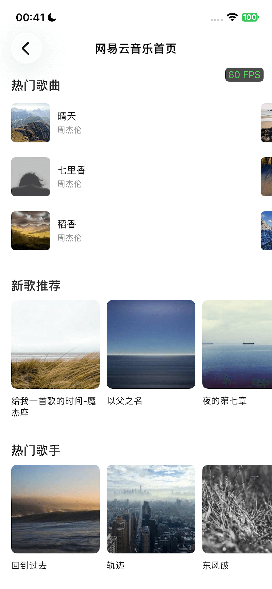

# TemplateX

高性能 iOS DSL 动态渲染框架

## 特性

- **高性能渲染**: 基于 Yoga Flexbox 布局引擎，支持复杂布局
- **ANTLR4 表达式引擎**: 跨端统一的表达式语法，支持数据绑定
- **增量更新**: Diff + Patch 算法，只更新变化的部分
- **视图复用**: 视图池化和组件缓存，减少内存分配
- **XML 编译器**: 开发时使用 XML，编译为优化的 JSON



## 架构

```
┌─────────────────────────────────────────────────────────┐
│                      TemplateXRenderEngine                       │
│                    (渲染引擎入口)                         │
└────────────────┬────────────────────────────────────────┘
                 │
    ┌────────────┼────────────┬──────────────┐
    │            │            │              │
    ▼            ▼            ▼              ▼
┌────────┐ ┌──────────┐ ┌──────────┐ ┌────────────┐
│Template│ │Expression│ │  Layout  │ │    Diff    │
│ Parser │ │  Engine  │ │  Engine  │ │   Patcher  │
└────────┘ └──────────┘ └──────────┘ └────────────┘
    │            │            │              │
    ▼            ▼            ▼              ▼
┌────────┐ ┌──────────┐ ┌──────────┐ ┌────────────┐
│  JSON  │ │  ANTLR4  │ │   Yoga   │ │   View     │
│Wrapper │ │  Parser  │ │ Flexbox  │ │  Recycler  │
└────────┘ └──────────┘ └──────────┘ └────────────┘
```

## 安装

### Swift Package Manager

```swift
dependencies: [
    .package(url: "https://github.com/FeliksLv01/TemplateX", from: "1.0.0")
]
```

### CocoaPods

```ruby
# 核心库
pod 'TemplateX'

# Service 实现（必须注册 ImageLoader）
pod 'TemplateXService'  # 默认包含 SDWebImage 图片加载器
```

**初始化（必须）**：

```swift
// AppDelegate.swift
import TemplateX
import TemplateXService

func application(_ application: UIApplication, didFinishLaunchingWithOptions ...) -> Bool {
    // 注册 ImageLoader（必须，否则 fatalError）
    // 也可自行遵循协议实现
    TemplateX.registerImageLoader(SDWebImageLoader())
    
    // 预热引擎（推荐）
    DispatchQueue.global(qos: .userInitiated).async {
        TemplateX.warmUp()
    }
    
    return true
}
```

## 快速开始

### 1. 基础渲染

```swift
import TemplateX

let template: [String: Any] = [
    "type": "container",
    "id": "card",
    "style": [
        "width": "100%",
        "height": 100,
        "flexDirection": "column",
        "padding": 16
    ],
    "children": [
        [
            "type": "text",
            "id": "title",
            "props": ["text": "Hello TemplateX!"],
            "style": ["fontSize": 16]
        ]
    ]
]

let view = TemplateXRenderEngine.shared.render(
    json: template,
    containerSize: CGSize(width: 375, height: 812)
)
```

### 2. 数据绑定

```swift
let template: [String: Any] = [
    "type": "text",
    "id": "greeting",
    "props": [
        "text": "\${user.name + ', 欢迎回来!'}"
    ],
    "style": [
        "fontSize": 16,
        "textColor": "#333333"
    ]
]

let data: [String: Any] = [
    "user": ["name": "Alice"]
]

let view = TemplateXRenderEngine.shared.render(
    json: template,
    data: data,
    containerSize: CGSize(width: 375, height: 100)
)
```

### 3. 增量更新

```swift
// 首次渲染
let view = TemplateXRenderEngine.shared.render(json: template, data: initialData, containerSize: size)

// 增量更新（只更新变化的部分）
TemplateXRenderEngine.shared.update(view: view, data: newData, containerSize: size)
```

### 4. 条件显示

```swift
let template: [String: Any] = [
    "type": "container",
    "id": "card",
    "style": ["width": "100%", "flexDirection": "column"],
    "children": [
        [
            "type": "text",
            "id": "vip_badge",
            "props": ["text": "VIP"],
            "style": [
                "backgroundColor": "#FFD700",
                "padding": 4,
                "cornerRadius": 4
            ],
            "bindings": [
                "display": "\${user.isVip}"  // 动态控制显示/隐藏
            ]
        ]
    ]
]

let data: [String: Any] = [
    "user": ["isVip": true]
]
```

## 组件列表

| 组件 | 类型 | 说明 |
|------|------|------|
| view | 容器 | 基础容器组件 |
| flex | 容器 | Flexbox 布局容器 |
| text | 展示 | 文本组件 |
| image | 展示 | 图片组件 |
| button | 交互 | 按钮组件 |
| input | 交互 | 输入框组件 |
| scroll | 容器 | 滚动视图 |
| list | 容器 | 列表组件（基于 UICollectionView） |

## 表达式语法

TemplateX 使用 `${expression}` 语法进行数据绑定，表达式写在 `${}` 内部。

### 取值表达式

```javascript
// 字符串取值
"${title}"

// 数组取值
"${data[0]}"
"${data.items[0]}"

// 字典取值
"${data.title}"
"${data.items[0].title}"

// 直接引用上下文变量
"${user.name}"
"${item.price}"
```

### 判断表达式

支持运算符：`==、!=、>、>=、<、<=、&&、||`

```javascript
// 等值判断
"${data.title == ''}"
"${data.title == 'string'}"

// 比较判断
"${data.age >= 18}"
"${data.count > 10}"

// 逻辑判断
"${data.isVip && data.hasDiscount}"
"${!data.isEmpty}"
```

### 计算表达式

支持运算符：`+、-、*、/、%`

```javascript
// 字符串拼接
"${'string' + data.title}"
"${'前缀' + data.name + '后缀'}"

// 数值运算
"${100 + data.num}"
"${data.price * 0.8}"
"${count + 1}"
```

### 三元表达式

```javascript
// 形式1：完整的条件表达式
"${data.isVip ? 'VIP用户' : '普通用户'}"
"${data.title ? 'flex' : 'none'}"
"${data.backgroundColor ? data.backgroundColor : 'green'}"

// 嵌套三元（需要使用括号）
"${(data.isVip ? 'VIP' : (data.level > 10 ? '高级' : '普通'))}"
```

### 混合字符串

表达式可以嵌入普通字符串中：

```javascript
// 多个表达式拼接
"Hello ${user.name}, you have ${notifications.count} new messages"

// 前后缀
"价格: ¥${item.price}"
"${user.name}，欢迎回来！"
```

### 内置函数

```javascript
// size - 获取长度，返回 int
"${size(data.nodes)}"        // 数组长度
"${size(data.dict)}"         // 字典长度
"${size(data.string)}"       // 字符串长度

// 数学函数
"${max(a, b)}"               // 最大值
"${min(a, b)}"               // 最小值
"${abs(value)}"              // 绝对值
```

### 自定义函数

可通过 ExpressionEngine 注册自定义函数：

```swift
// 注册简单函数
ExpressionEngine.shared.registerFunction(name: "formatPrice") { args in
    guard let price = args.first as? Double else { return nil }
    return String(format: "¥%.2f", price)
}

// 在模板中使用
// "text": "${formatPrice(item.price)}"
```

## 布局属性

布局和样式统一在 `style` 字段中：

```json
{
    "style": {
        // 尺寸
        "width": "100%",          // "100%" | "auto" | 200 | "50%"
        "height": "auto",         // "auto" 表示由内容撑开
        
        // 边距
        "margin": 16,             // 数字或 [top, right, bottom, left]
        "marginTop": 8,
        "marginRight": 16,
        "marginBottom": 8,
        "marginLeft": 16,
        
        // 内边距
        "padding": 16,
        "paddingTop": 8,
        
        // Flexbox 属性
        "flexDirection": "row",   // "row" | "column" | "row-reverse" | "column-reverse"
        "justifyContent": "center", // "flex-start" | "flex-end" | "center" | "space-between" | "space-around"
        "alignItems": "center",   // "flex-start" | "flex-end" | "center" | "stretch" | "baseline"
        "flexWrap": "wrap",       // "nowrap" | "wrap" | "wrap-reverse"
        "flexGrow": 1,
        "flexShrink": 0,
        "flexBasis": "auto",
        "alignSelf": "center"
    }
}
```

## 样式属性

```json
{
    "style": {
        "backgroundColor": "#FFFFFF",
        "cornerRadius": 8,
        "borderWidth": 1,
        "borderColor": "#E0E0E0",
        "shadowColor": "#000000",
        "shadowOffset": [0, 2],
        "shadowRadius": 4,
        "shadowOpacity": 0.1,
        "opacity": 0.9
    }
}
```

## 显示控制

### display（控制是否占空间）

```json
{
    "style": {
        "display": "flex"  // "flex" 显示 | "none" 隐藏且不占空间
    },
    "bindings": {
        "display": "\${user.isVip}"  // 动态控制：true=flex, false=none
    }
}
```

### visibility（占空间但不可见）

```json
{
    "style": {
        "visibility": "visible"  // "visible" 可见 | "hidden" 不可见但占空间
    }
}
```

### 列表渲染

使用 `list` 组件进行列表渲染：

```json
{
    "type": "list",
    "id": "product_list",
    "style": {
        "width": "100%",
        "height": "auto"  // 自动高度，由内容撑开
    },
    "props": {
        "items": "\${products}",  // 绑定数据源
        "itemTemplate": {
            "type": "container",
            "style": { "padding": 16 },
            "children": [
                {
                    "type": "text",
                    "props": { "text": "\${item.name}" }  // item 代表每一项
                }
            ]
        }
    }
}
```

## 性能优化

### 1. 预热（推荐）

在 App 启动时预热引擎，消除首次渲染的冷启动开销：

```swift
// AppDelegate.swift
func application(_ application: UIApplication, didFinishLaunchingWithOptions ...) {
    // 异步预热（推荐）
    DispatchQueue.global(qos: .userInitiated).async {
        TemplateX.warmUp()
    }
    
    return true
}
```

### 2. Cell 场景优化

针对 UICollectionView/UITableView 场景，使用缓存 API：

```swift
// 使用模板缓存渲染
let view = TemplateXRenderEngine.shared.renderWithCache(
    json: template,
    templateId: "my_cell",  // 缓存 key
    data: data,
    containerSize: size
)

// 计算高度（带缓存）
let height = TemplateXRenderEngine.shared.calculateHeight(
    json: template,
    templateId: "my_cell",
    data: data,
    containerWidth: width,
    useCache: true
)
```

### 3. 性能监控

```swift
// 启用性能监控
TemplateXRenderEngine.shared.config.enablePerformanceMonitor = true

// 查看性能日志
// [TemplateX][Trace] render: total=3.2ms | parse=0.8ms | layout=1.2ms | create=1.2ms
```

### 4. 性能配置

```swift
let engine = TemplateXRenderEngine.shared

// 启用 Yoga 增量布局（默认开启）
YogaLayoutEngine.shared.enableIncrementalLayout = true

// 启用视图拍平优化（默认开启）
// 纯布局容器不创建真实 UIView，减少层级
```

## 扩展指南

TemplateX 提供了灵活的扩展机制，支持自定义组件和表达式函数。

### 自定义组件

#### 1. 创建组件类

继承 `BaseComponent` 并实现 `ComponentFactory` 协议：

```swift
import TemplateX

// 自定义视频播放器组件
public class VideoComponent: BaseComponent, ComponentFactory {
    
    // MARK: - ComponentFactory
    
    /// 组件类型标识，对应模板中的 "type": "video"
    public static var typeIdentifier: String { "video" }
    
    /// 工厂方法：从 JSON 创建组件
    public static func create(from json: JSONWrapper) -> Component {
        let component = VideoComponent(
            id: json.string("id") ?? UUID().uuidString,
            type: typeIdentifier
        )
        // 解析通用样式（布局、背景、边框等）
        component.parseBaseParams(from: json)
        
        // 解析组件特有的属性
        if let props = json.child("props") {
            component.videoUrl = props.string("src")
            component.autoPlay = props.bool("autoPlay") ?? false
            component.showControls = props.bool("controls") ?? true
        }
        return component
    }
    
    // MARK: - 自定义属性
    
    var videoUrl: String?
    var autoPlay: Bool = false
    var showControls: Bool = true
    
    // MARK: - 视图生命周期
    
    /// 创建原生视图
    public override func createView() -> UIView {
        let playerView = VideoPlayerView()
        playerView.delegate = self
        return playerView
    }
    
    /// 更新视图（数据绑定后调用）
    public override func updateView() {
        super.updateView()  // 应用通用样式
        
        guard let player = view as? VideoPlayerView else { return }
        
        if let url = videoUrl {
            player.load(url: url)
        }
        player.showControls = showControls
        
        if autoPlay {
            player.play()
        }
    }
    
    /// 克隆组件（用于 Diff 算法）
    public override func clone() -> Component {
        let cloned = VideoComponent(id: id, type: type)
        cloned.style = style
        cloned.bindings = bindings
        cloned.events = events
        cloned.videoUrl = videoUrl
        cloned.autoPlay = autoPlay
        cloned.showControls = showControls
        return cloned
    }
}
```

#### 2. 注册组件

在 App 启动时注册：

```swift
// AppDelegate.swift
func application(_ application: UIApplication, 
                 didFinishLaunchingWithOptions launchOptions: [UIApplication.LaunchOptionsKey: Any]?) -> Bool {
    
    // 注册自定义组件
    TemplateX.register(VideoComponent.self)
    TemplateX.register(LottieComponent.self)
    TemplateX.register(MapComponent.self)
    
    // 预热引擎
    DispatchQueue.global(qos: .userInitiated).async {
        TemplateX.warmUp()
    }
    
    return true
}
```

#### 3. 在模板中使用

```json
{
    "type": "video",
    "id": "player",
    "props": {
        "src": "${videoUrl}",
        "autoPlay": true,
        "controls": true
    },
    "style": {
        "width": "100%",
        "aspectRatio": 1.78,
        "cornerRadius": 8
    },
    "events": {
        "onEnd": {
            "action": "playNext"
        }
    }
}
```

### 自定义表达式函数

#### 1. 简单函数（闭包方式）

适用于简单的工具函数：

```swift
// 价格格式化
ExpressionEngine.shared.registerFunction(name: "formatPrice") { args in
    guard let price = args.first as? Double else { return "¥0.00" }
    return String(format: "¥%.2f", price)
}

// 相对时间
ExpressionEngine.shared.registerFunction(name: "timeAgo") { args in
    guard let timestamp = args.first as? Double else { return "" }
    let date = Date(timeIntervalSince1970: timestamp)
    let formatter = RelativeDateTimeFormatter()
    formatter.locale = Locale(identifier: "zh_CN")
    return formatter.localizedString(for: date, relativeTo: Date())
}

// 数组过滤
ExpressionEngine.shared.registerFunction(name: "filterByStatus") { args in
    guard let items = args.first as? [[String: Any]],
          let status = args[safe: 1] as? String else { return [] }
    return items.filter { ($0["status"] as? String) == status }
}

// 业务判断（访问全局状态）
ExpressionEngine.shared.registerFunction(name: "isLoggedIn") { _ in
    return UserManager.shared.isLoggedIn
}

ExpressionEngine.shared.registerFunction(name: "isVip") { _ in
    return UserManager.shared.currentUser?.isVip ?? false
}
```

#### 2. 协议方式（复杂函数）

适用于需要更多控制的场景：

```swift
/// 货币格式化函数
struct FormatCurrencyFunction: ExpressionFunction {
    let name = "formatCurrency"
    
    func execute(_ args: [Any]) -> Any? {
        guard args.count >= 1 else { return nil }
        
        let amount = (args[0] as? Double) ?? 0
        let currencyCode = (args[safe: 1] as? String) ?? "CNY"
        
        let formatter = NumberFormatter()
        formatter.numberStyle = .currency
        formatter.currencyCode = currencyCode
        return formatter.string(from: NSNumber(value: amount))
    }
}

/// 距离格式化函数
struct FormatDistanceFunction: ExpressionFunction {
    let name = "formatDistance"
    
    func execute(_ args: [Any]) -> Any? {
        guard let meters = args.first as? Double else { return "" }
        
        if meters < 1000 {
            return String(format: "%.0fm", meters)
        } else {
            return String(format: "%.1fkm", meters / 1000)
        }
    }
}

// 注册
ExpressionEngine.shared.registerFunction(FormatCurrencyFunction())
ExpressionEngine.shared.registerFunction(FormatDistanceFunction())
```

#### 3. 批量注册

推荐在 App 启动时统一注册：

```swift
// BusinessFunctions.swift
enum BusinessFunctions {
    static func registerAll() {
        let functions: [ExpressionFunction] = [
            FormatCurrencyFunction(),
            FormatDistanceFunction(),
            SimpleFunction(name: "formatPrice") { args in
                guard let price = args.first as? Double else { return "¥0.00" }
                return String(format: "¥%.2f", price)
            },
            SimpleFunction(name: "isVip") { _ in
                UserManager.shared.currentUser?.isVip ?? false
            }
        ]
        ExpressionEngine.shared.registerFunctions(functions)
    }
}

// AppDelegate.swift
func application(...) {
    BusinessFunctions.registerAll()
    // ...
}
```

#### 4. 在模板中使用

```json
{
    "type": "container",
    "style": { "flexDirection": "column", "gap": 8 },
    "children": [
        {
            "type": "text",
            "props": { "text": "${formatPrice(item.price)}" }
        },
        {
            "type": "text",
            "props": { "text": "${timeAgo(item.createTime)}" }
        },
        {
            "type": "text",
            "props": { "text": "距您 ${formatDistance(item.distance)}" }
        },
        {
            "type": "container",
            "bindings": { "display": "${isVip()}" },
            "children": [
                { "type": "text", "props": { "text": "VIP 专属" } }
            ]
        }
    ]
}
```

### 内置函数一览

| 类别 | 函数 | 说明 |
|------|------|------|
| **数学** | `abs(x)` | 绝对值 |
| | `max(a, b, ...)` | 最大值 |
| | `min(a, b, ...)` | 最小值 |
| | `round(x)` | 四舍五入 |
| | `floor(x)` | 向下取整 |
| | `ceil(x)` | 向上取整 |
| | `sqrt(x)` | 平方根 |
| | `pow(x, y)` | x 的 y 次方 |
| **字符串** | `length(s)` | 字符串/数组长度 |
| | `uppercase(s)` | 转大写 |
| | `lowercase(s)` | 转小写 |
| | `trim(s)` | 去除首尾空白 |
| | `substring(s, start, len)` | 截取子串 |
| | `contains(s, search)` | 包含判断 |
| | `startsWith(s, prefix)` | 前缀判断 |
| | `endsWith(s, suffix)` | 后缀判断 |
| | `replace(s, old, new)` | 替换 |
| | `split(s, separator)` | 分割为数组 |
| | `join(arr, separator)` | 数组拼接为字符串 |
| **格式化** | `formatNumber(n, decimals)` | 数字格式化 |
| | `formatDate(ts, format)` | 日期格式化 |
| **条件** | `ifEmpty(value, fallback)` | 空值回退 |
| | `ifNull(value, fallback)` | null 值回退 |
| **类型转换** | `toString(x)` | 转字符串 |
| | `toNumber(x)` | 转数字 |
| | `toBoolean(x)` | 转布尔值 |
| **数组** | `first(arr)` | 第一个元素 |
| | `last(arr)` | 最后一个元素 |
| | `indexOf(arr, item)` | 查找索引 |
| | `reverse(arr)` | 反转 |

## 项目结构

```
TemplateX/                           # Git 仓库根目录
├── TemplateX/                       # 核心库
│   └── Sources/
│       ├── TemplateX.swift          # 主入口
│       ├── Core/
│       │   ├── Engine/              # 渲染引擎
│       │   ├── Template/            # 模板解析
│       │   ├── Layout/              # 布局系统
│       │   ├── Expression/          # 表达式引擎
│       │   ├── Binding/             # 数据绑定
│       │   ├── Diff/                # Diff 算法
│       │   ├── Event/               # 事件系统
│       │   ├── Cache/               # 缓存系统
│       │   └── Performance/         # 性能监控
│       ├── Components/              # 组件实现
│       └── Service/                 # Service 协议层
│           ├── ServiceRegistry.swift
│           ├── ImageLoader/         # ImageLoader 协议
│           └── LogProvider/         # LogProvider 协议 + 默认实现
├── TemplateXService/                # Service 实现层
│   ├── Image/                       # SDWebImage 实现
│   │   └── SDWebImageLoader.swift
│   └── Log/                         # Console 日志实现
│       └── ConsoleLogProvider.swift
├── Compiler/                        # XML 编译器（开发工具，不打包）
├── Example/                         # 示例 App
├── Tests/                           # 测试用例
├── TemplateX.podspec                # 核心库 podspec
└── TemplateXService.podspec         # Service 实现 podspec
```

## Service 架构

TemplateX 采用 Service 架构，将外部依赖（如图片加载、日志）抽象为协议，由上层注入实现。

### 架构图

```
┌─────────────────────────────────────────────────────────┐
│                      TemplateX                          │
│  ┌─────────────┐  ┌─────────────┐  ┌─────────────────┐  │
│  │ RenderEngine│  │ Components  │  │ ServiceRegistry │  │
│  └─────────────┘  └─────────────┘  └────────┬────────┘  │
│                                             │           │
│          ┌──────────────────────────────────┤           │
│          │                                  │           │
│  ┌───────▼───────┐              ┌───────────▼────────┐  │
│  │TemplateX      │              │TemplateX           │  │
│  │ImageLoader    │              │LogProvider         │  │
│  │(协议)         │              │(协议+默认实现)       │  │
│  └───────────────┘              └────────────────────┘  │
└─────────────────────────────────────────────────────────┘
                    │                        │
                    ▼                        ▼
┌─────────────────────────────────────────────────────────┐
│                   TemplateXService                      │
│  ┌───────────────────┐          ┌────────────────────┐  │
│  │ SDWebImageLoader  │          │ ConsoleLogProvider │  │
│  │ (SDWebImage实现)   │          │ (print实现)         │  │
│  └───────────────────┘          └────────────────────┘  │
└─────────────────────────────────────────────────────────┘
```

### ImageLoader（必须注册）

图片加载器协议，用于加载网络图片和本地图片。**必须在使用 TemplateX 前注册**，否则会 fatalError。

```swift
// 协议定义
public protocol TemplateXImageLoader: AnyObject {
    func loadImage(url: String, placeholder: String?, into imageView: UIImageView, completion: ((UIImage?) -> Void)?)
    func cancelLoad(for imageView: UIImageView)
    func prefetchImages(urls: [String])
    func clearCache(type: ImageCacheType)
}

// 注册（AppDelegate）
TemplateX.registerImageLoader(SDWebImageLoader())
```

### LogProvider（可选，有默认实现）

日志提供者协议。**有默认实现**（DefaultLogProvider），iOS 14+ 使用 `os.Logger`，iOS 14 以下静默。

```swift
// 协议定义
public protocol TemplateXLogProvider: AnyObject {
    func log(level: TXLogLevel, message: String, file: String, function: String, line: Int)
}

// 可选：注册自定义实现
TemplateX.registerLogProvider(ConsoleLogProvider())
```

### 自定义 Service 实现

如果不想使用 SDWebImage，可以自己实现 `TemplateXImageLoader`：

```swift
// 使用 Kingfisher 实现
class KingfisherImageLoader: TemplateXImageLoader {
    func loadImage(url: String, placeholder: String?, into imageView: UIImageView, completion: ((UIImage?) -> Void)?) {
        imageView.kf.setImage(with: URL(string: url), placeholder: UIImage(named: placeholder ?? ""))
        // ...
    }
    // 实现其他方法...
}

// 注册
TemplateX.registerImageLoader(KingfisherImageLoader())
```

## XML 编译器

TemplateX 提供 XML 编译器，让你可以使用更友好的 XML 语法编写模板，然后编译为运行时使用的 JSON。

### XML 语法示例

```xml
<?xml version="1.0" encoding="UTF-8"?>
<Template name="simple_card" version="1.0" description="简单卡片">
    <Column
        id="root"
        width="100%"
        height="auto"
        padding="16"
        backgroundColor="#FFFFFF"
        borderRadius="12">
        
        <!-- 标题 -->
        <Text
            id="title"
            text="${item.title}"
            fontSize="18"
            fontWeight="bold"
            textColor="#333333"
            marginBottom="8"/>
        
        <!-- 描述 -->
        <Text
            id="description"
            text="${item.description}"
            fontSize="14"
            textColor="#666666"
            maxLines="2"/>
        
        <!-- 底部信息 -->
        <Row
            id="footer"
            width="100%"
            justifyContent="space-between"
            alignItems="center"
            marginTop="12">
            
            <Text
                id="author"
                text="${item.author}"
                fontSize="12"
                textColor="#999999"/>
            
            <Text
                id="time"
                text="${item.createTime}"
                fontSize="12"
                textColor="#999999"/>
        </Row>
    </Column>
</Template>
```

### 支持的 XML 标签

| XML 标签 | JSON 组件类型 | 说明 |
|---------|-------------|------|
| `<Template>` | - | 模板根节点，包含 name/version/description |
| `<Flex>` / `<Box>` | `flex` | Flexbox 容器 |
| `<Row>` | `flex` | 水平布局（自动设置 flexDirection: row） |
| `<Column>` | `flex` | 垂直布局（自动设置 flexDirection: column） |
| `<View>` | `view` | 基础视图 |
| `<Text>` / `<TextView>` | `text` | 文本 |
| `<Image>` / `<ImageView>` | `image` | 图片 |
| `<Button>` | `button` | 按钮 |
| `<Input>` / `<EditText>` | `input` | 输入框 |
| `<ScrollView>` | `scroll` | 滚动视图 |
| `<ListView>` / `<RecyclerView>` | `list` | 列表 |

### 使用编译器

#### 方式1: Swift 代码调用

```swift
import Foundation

// 加载编译器文件后使用
let compiler = XMLToJSONCompiler()

// 编译 XML 字符串
let json = try compiler.compile(xmlString)

// 编译为 JSON 字符串
let jsonString = try compiler.compileToString(xmlString)

// 编译并写入文件
try compiler.compile(xmlString, outputURL: outputURL)
```

#### 方式2: 命令行工具

```bash
# 编译单个文件
swift Compiler/TemplateXCLI.swift compile template.xml

# 指定输出路径
swift Compiler/TemplateXCLI.swift compile template.xml -o output.json

# 压缩输出
swift Compiler/TemplateXCLI.swift compile template.xml -m

# 包含调试信息
swift Compiler/TemplateXCLI.swift compile template.xml -d

# 批量编译目录
swift Compiler/TemplateXCLI.swift compile ./templates -o ./output -r

# 验证 XML 语法
swift Compiler/TemplateXCLI.swift validate template.xml
```

#### 方式3: 集成到构建流程

```ruby
# Podfile
script_phase :name => 'Compile Templates',
             :script => 'swift "${SRCROOT}/../Compiler/TemplateXCLI.swift" compile "${SRCROOT}/Templates" -o "${SRCROOT}/Resources/templates" -r -m',
             :execution_position => :before_compile
```

### 编译选项

| 选项 | 说明 |
|-----|------|
| `-o, --output <path>` | 输出文件或目录 |
| `-m, --minify` | 压缩 JSON 输出 |
| `-d, --debug` | 包含调试信息 |
| `-r, --recursive` | 递归处理子目录 |

### 编译器文件

```
Compiler/
├── TemplateXCLI.swift         # 命令行入口
├── XMLToJSONCompiler.swift    # 核心编译逻辑
├── TemplateXMLParser.swift    # XML 解析器
├── AttributeMapper.swift      # 属性映射（标签名、属性名转换）
├── UnitParser.swift           # 单位解析（尺寸、颜色）
├── ExpressionExtractor.swift  # 表达式提取
├── XMLNode.swift              # XML 节点模型
└── Tests/                     # 测试文件
    ├── simple_card.xml
    ├── product_card.xml
    └── user_profile.xml
```

> **注意**: Compiler 目录不包含在 Pod 中，仅作为开发工具使用。编译后的 JSON 文件才是运行时使用的模板。

## 测试

```bash
swift test
```

## 示例 App

参考 [Example/TemplateXDemo/README.md](Example/TemplateXDemo/README.md)

## License

MIT License
